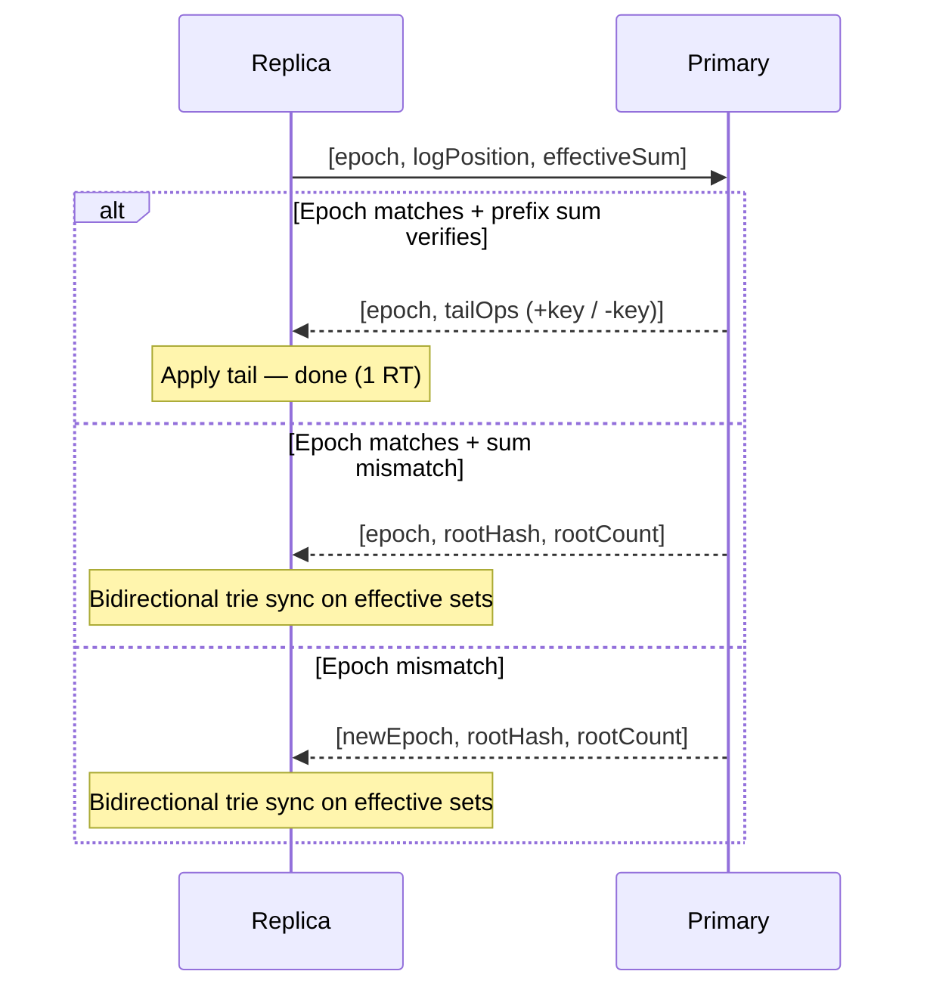
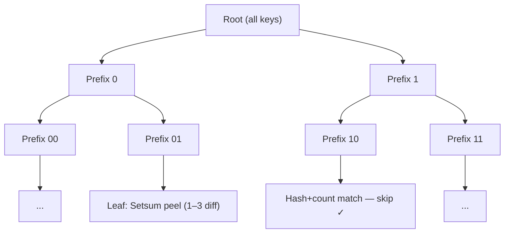

# Setsum Sync

A unidirectional, stateless set-reconciliation protocol for efficiently synchronising two sets of 32-byte keys across a network. Sync always flows **primary → replica**: the primary is the authoritative owner of the set, and replicas converge to it. The primary keeps **no per-replica state** — every sync is self-describing because the replica sends its own position and checksum in a single message.

The protocol minimises round-trips by trying a sequence-based fast path before falling back to a binary-prefix trie traversal. The trie traversal itself is bidirectional (it discovers items to add *and* remove from the replica in a single pass), but the sync direction is always primary → replica.

This protocol assumes all participating nodes are mutually trusted — reported counts and sums are accepted at face value.

---

## Data Model

Both the primary and each replica maintain their own independent copy of the same structures:

- **Operation log** — an ordered sequence of inserts (`+key`) and deletes (`-key`), with prefix sums tracking the effective setsum at each position
- **Effective set** — the current membership set, maintained as a sorted store for trie-based queries
- **Epoch** — incremented on compaction; gives replicas an unambiguous signal that the log was squashed

The setsum's invertibility means prefix sums work naturally over mixed operations:

```
Log:       [+A, +B, -A, +C]
PrefixSum: [H(A), H(A)+H(B), H(B), H(B)+H(C)]
```

The prefix sum at any position is the setsum of the effective set at that point.

The primary's log is authoritative. A replica's log tracks its own view — during sync, the replica sends `(epoch, logPosition, effectiveSum)` and the primary responds purely from its own log and effective set, with no memory of any previous sync. This means any number of replicas can sync independently, and a replica that goes offline for an arbitrary period simply resumes from wherever it left off.

**Compaction** squashes the log down to just the current effective set (all inserts), re-sequences, and increments the epoch. There is no separate tombstone store to wipe — the replica just knows its log position is stale and falls back to a single trie sync over effective membership.

---

## Core Data Structure: Setsum

A `Setsum` is a commutative, invertible hash over a set of items:

- **Additive**: `sum(A ∪ B) = sum(A) + sum(B)`
- **Invertible**: `sum(A) - sum(B) = sum(A \ B)` when B ⊆ A
- **Order-independent**: inserting items in any order gives the same sum

This lets the primary node compute what a replica is missing by subtraction alone — and at trie leaves, identify up to 3 missing items without a full key exchange.

---

## Sync Protocol

Every sync is initiated by the replica. It sends its epoch, log position, and effective-set sum in a single message — this fully describes the replica's state without the primary needing to remember anything about it. The primary's response determines which path follows.



### Fast path

The primary maintains prefix sums over its operation log. It verifies that `prefixSum[replicaLogPosition] == replicaEffectiveSum` — i.e. the replica's effective set matches the primary's at that log position. If so, it sends the tail operations — both adds and deletes in one stream.

This resolves any diff in 1 RT as long as the replica is simply behind — a diff of 1 item or 100,000 items is the same cost. Deletes flow through the exact same fast path as adds.

### Trie sync — the universal fallback

The trie sync is not specific to any one failure mode. It is the single repair mechanism for all forms of divergence:

- **Sum mismatch** — the replica has lost or gained items; the bidirectional trie finds and corrects all differences
- **Epoch mismatch** — the primary has compacted; one trie sync over effective sets converges both sides

After any trie sync, the replica rebuilds its operation log from its current effective set so the fast path works again on the next sync.

On epoch mismatch the primary piggybacks root `(hash, count)` for the effective set in its response, so the trie BFS can start immediately with no extra round trip.

---

## Trie Sync (Fallback)

Keys are sorted by their bit representation; each trie node covers all keys sharing a common bit-prefix. The protocol exchanges subtree `(hash, count)` pairs level by level, recursing into subtrees where the two sides differ, until each is small enough to resolve directly.

The traversal is bidirectional in the sense that it discovers differences in both directions — items the replica is missing (added from primary) and items the replica has that the primary doesn't (removed from replica) — but the goal is always to converge the replica to the primary's state:



One round trip per depth level, batching all leaf resolutions and child expansions. A node becomes a leaf when:

- `primaryCount == 0` — replica's items are stale; removed locally with no wire traffic
- `replicaCount == 0` — primary sends all its items directly
- `|primaryCount − replicaCount| ≤ 3` — resolved via Setsum peeling
- `depth ≥ MaxPrefixDepth` — full key exchange

### Leaf resolution via Setsum peeling

**Primary ahead** (`signedDiff > 0`): Replica sends its prefix hash; primary subtracts to isolate the diff and identifies the 1–3 missing items by scanning its local hashes.

**Replica ahead** (`signedDiff < 0`): The primary's hash is already in scope from the expansion response. The replica peels locally — **zero wire cost**.

**Same count, different hash** (`signedDiff == 0`): Expanded further.

---

## Wire Protocol

All messages are binary with VarInt-encoded counts. Key = 32 B, Setsum = 32 B.

### Sequence request (replica → primary)

| Field | Size |
|---|---|
| epoch | varint |
| logPosition | varint |
| effectiveSum | 32 B |

Covers everything in one round trip.

### Sequence response (primary → replica)

**Fast path success:**

| Field | Size |
|---|---|
| epoch | varint |
| opCount | varint |
| ops | opCount × (1 B flag + 32 B key) |

Each operation carries a 1-byte flag (add or delete) and the 32-byte key.

**Epoch or sum mismatch:**

| Field | Size |
|---|---|
| newEpoch | varint |
| rootHash | 32 B |
| rootCount | varint |

Followed by trie sync rounds.

### Trie expansion (per BFS level)

**Request** (replica → primary): prefix bytes per child — `ceil(depth / 8)` bytes each.

**Response** (primary → replica): `varint(count) + 32 B hash` per child (hash omitted when count = 0).

### Leaf resolution (within the same BFS round trip)

| Case | Tx | Rx |
|---|---|---|
| replicaCount == 0 | prefix bytes | count × 32 B keys |
| signedDiff > 0 (primary ahead) | prefix + 32 B replicaHash | count × 32 B missing keys |
| signedDiff < 0 (replica ahead) | — | — (replica peels locally) |
| signedDiff == 0 | — | — (expanded further) |
| depth ≥ MaxPrefixDepth | prefix + count × 32 B replicaKeys | count × 32 B keys to add |

---

## Complexity

| Scenario | Round Trips | Notes |
|---|---|---|
| Sets identical | 1 | Sequence check, single message |
| Replica behind by D items (adds and/or deletes) | 1 | Tail send, any D |
| Sum mismatch (corruption) | 1 + O(log N) | 1 RT detects mismatch, trie sync repairs |
| Epoch mismatch | 1 + O(log N) | Root info piggybacked, single trie pass |

---

## Key Files

| File | Purpose |
|---|---|
| `Setsum.cs` | Commutative, invertible 256-bit hash with SIMD arithmetic |
| `SortedKeyStore.cs` | Sorted flat array with O(log N) range-hash queries and Setsum peeling |
| `ReconcilableSet.cs` | Sorted set with trie prefix queries and leaf resolution |
| `SyncableNode.cs` | Per-node operation log, effective set, compaction, and epoch management |
| `SyncNodes.cs` | Sync orchestration and wire-byte accounting |
| `SyncNodes.Triesync.cs` | Bidirectional trie BFS with combined leaf+expansion round trips |
| `BitPrefix.cs` | Bit-level trie prefix with multi-bit extension |
