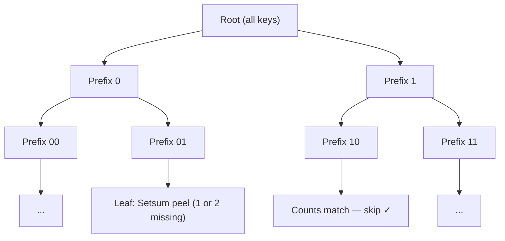
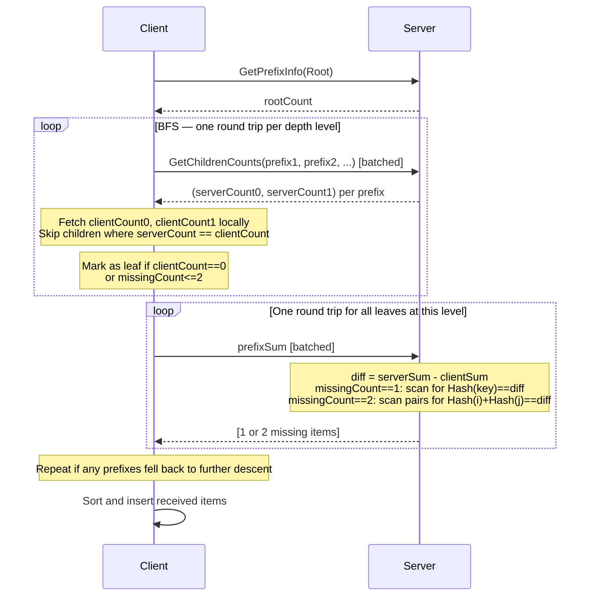
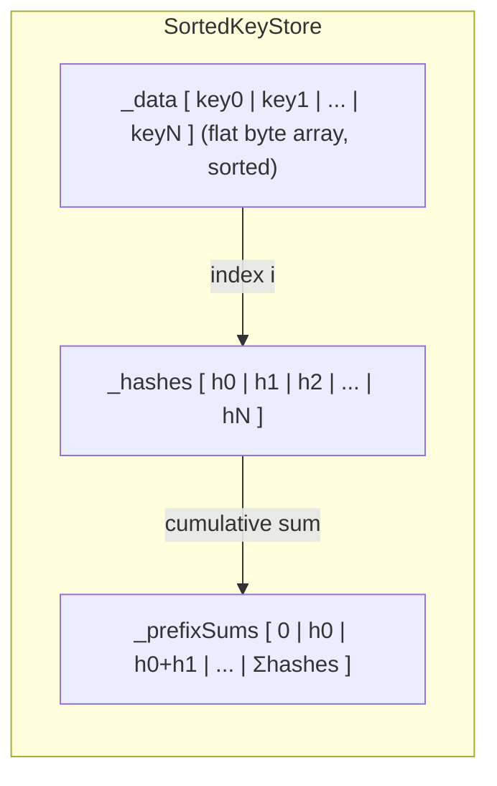
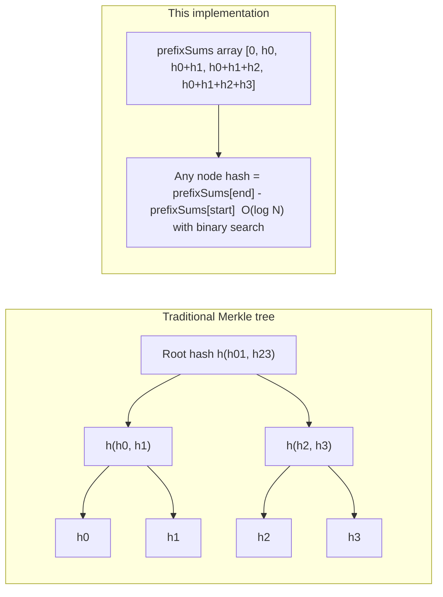
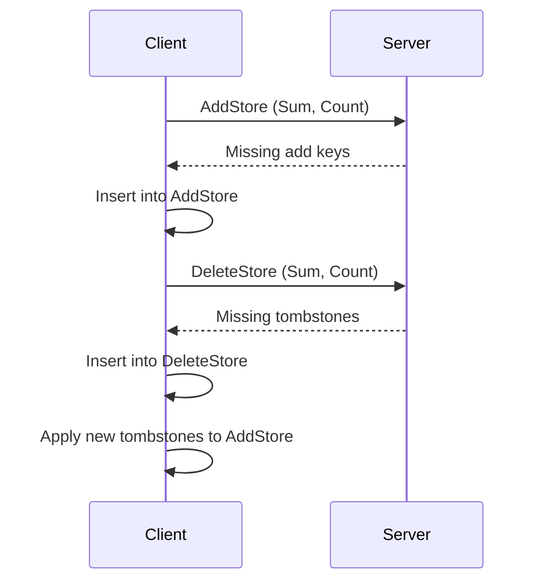
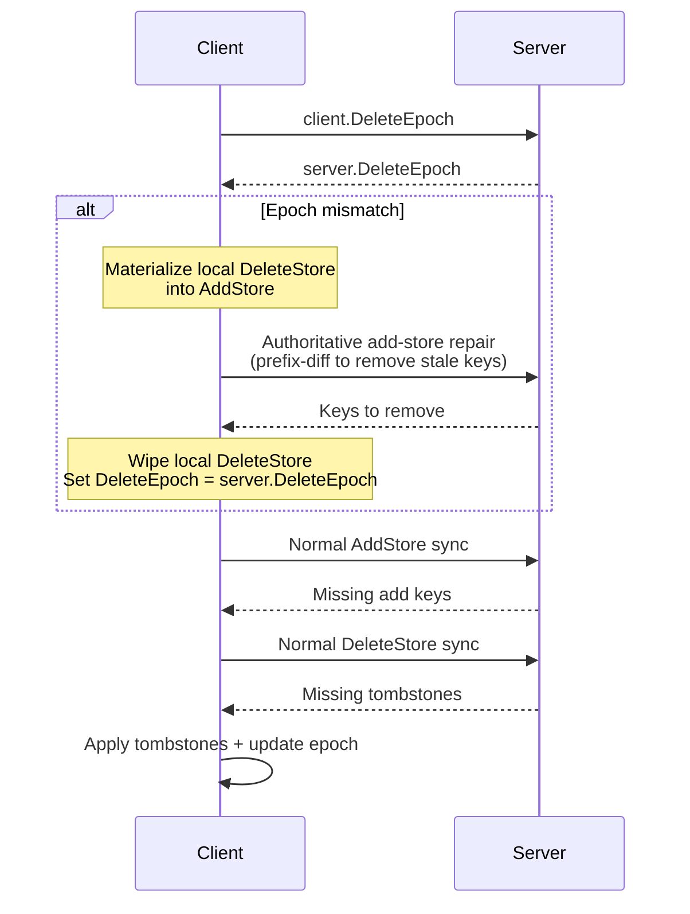

# Setsum Sync

A set-reconciliation library for efficiently synchronising two sets of 32-byte keys across a network. The protocol minimises round-trips by trying fast heuristic paths before falling back to a full binary-prefix trie traversal.

---

## Overview

The core challenge: two nodes each hold a set of 32-byte keys. They want to converge to the same set with as few network round-trips as possible, without transferring keys they already share.

The protocol is **unidirectional** — the server transfers items it has to the client. It does not support the case where both sides are ahead of each other. The BFS uses `missingCount = serverCount - clientCount` to decide when to stop descending, so when both sides have extra items under a prefix the counts partially cancel — a prefix where the server has 5 extras and the client has 5 extras looks like `missingCount == 0` and gets skipped entirely, silently dropping all 10 differences.

The library solves this in two escalating strategies:

1. **Fast Path** — Setsum peeling (1 round-trip, works for tiny diffs)
2. **Trie Fallback** — binary-prefix trie traversal for large diffs (O(log N) round-trips)

---

## Core Data Structure: Setsum

A `Setsum` is a commutative, invertible hash over a set of items. Its key properties are:

- **Additive**: `sum(A ∪ B) = sum(A) + sum(B)`
- **Invertible**: `sum(A) - sum(B) = sum(A \ B)` when B ⊆ A
- **Order-independent**: inserting items in any order gives the same sum

This allows the server to compute what a client is missing by subtraction alone — and at trie leaves, to identify up to 2 missing items without a key exchange.

---

## The Two Sync Paths

### Path 1: Fast Path (Setsum Peeling)

The client sends its `(Sum, Count)` tuple to the server. The server subtracts to find the diff sum and count, then tries to identify the missing items by searching its recent insertion history.


**When it works:** The diff is ≤ 10 items and all missing items appear in the server's recent history (circular buffer of 128 entries).

**Peeling algorithm:** Recursive backtracking search over recent history. For diffs of ≤ 3 items it searches the full 128-entry history; for diffs of 4–10 items it limits to the 20 most recent entries.

---

### Path 2: Trie Fallback

A binary-prefix trie traversal. Keys are compared bit-by-bit from the most significant bit. Each trie node covers all keys sharing a common bit-prefix. The client and server exchange subtree counts, recursing only into subtrees where the server has more items than the client, until each differing subtree is small enough to resolve via Setsum peeling.

Because the protocol is unidirectional, **counts alone are sufficient to prune the trie** — no hashes are exchanged during BFS traversal. `serverCount == clientCount` guarantees the subtrees are identical; `serverCount > clientCount` means the server has items the client is missing.



#### BFS traversal

The BFS processes one full depth level per round trip (level-batched). For each node, the server returns the counts for both children. Children are enqueued only if `serverCount > clientCount` — equal counts mean identical subtrees and are skipped immediately.

A node becomes a leaf when:
- `clientCount == 0` — client has nothing here; server sends all its items directly, or
- `missingCount <= 2` — at most two items are missing; resolved via Setsum peeling (see below), or
- `prefix.Length >= MaxPrefixDepth` — maximum trie depth reached.

All leaf resolutions are batched into a single round trip per BFS level. If a leaf's server-side prefix is too large for pair peeling, it is re-enqueued through the partition check for further descent rather than dropped.



#### Leaf resolution via Setsum peeling

At each leaf the client sends only its `prefixSum` — 32 bytes. The server computes:

```
diff = serverPrefixSum - clientPrefixSum
```

**missingCount == 1:** `diff` equals exactly one item's hash. The server does one linear scan over its items under that prefix and returns the matching key. No key list is exchanged — only the 32-byte summary goes up and the single key comes back.

**missingCount == 2:** `diff` equals the sum of exactly two items' hashes. The server tries all O(n²) pairs of items under the prefix, checking whether `hash[i] + hash[j] == diff`. This is only attempted when the server holds at most `MaxServerCountForPairPeel` (256) items under that prefix, keeping the search space bounded (≤ 65,536 pairs). If the prefix is larger the server returns `Fallback` and the client descends further.

For `clientCount == 0` the server simply returns all its items under the prefix directly, since there is no client sum to subtract from.

Both scans read directly from the stored `_hashes[]` array in `SortedKeyStore` — no re-hashing of keys is performed, and no key copies are allocated until a match is confirmed.

---

## Storage: `SortedKeyStore`

Keys are stored in a flat `byte[]` array sorted by lexicographic key order. A `Setsum[]` array holds the corresponding hash for each key, enabling O(log N) range-hash queries via prefix sums.



**Range query**: `RangeInfo(lo, hi)` binary-searches for `start` and `end`, then returns `prefixSums[end] - prefixSums[start]` in O(log N).

**Peeling scan**: `TryPeelRange(lo, hi, diff, maxCount)` walks `_hashes[start..end]` directly for both the linear (missingCount==1) and pair (missingCount==2) scans. Keys are only copied off `_data` when a match is confirmed — the miss path allocates nothing.

**Pending buffer**: New insertions go into an unsorted `_pending` buffer. It is radix-sorted and merged into the main store lazily on the next query — avoiding repeated O(N log N) sorts during bulk inserts.

**Radix sort**: Two-pass LSB radix sort on key bytes 0–1, followed by insertion sort within same-prefix buckets (~15 items each, all in L1 cache). This achieves O(N) sort with sequential memory access.

---

## Why Setsum Works for Trie Leaves

The Setsums used for fast-path peeling and the Setsums used at trie leaves for `missingCount <= 2` resolution are **not independent** — they are just computed over different subsets of the data. During BFS traversal no hashes are exchanged at all; Setsums only appear at leaves where the client sends its `prefixSum` for the server to peel against.

Every key `k` has exactly one per-item hash `h_k = Setsum.Hash(k)`, computed once on insertion. The trie node hash for any prefix is simply the sum of `h_k` over all keys under that prefix — recoverable in O(log N) from the prefix-sum array.

At a trie leaf where `missingCount == 1`:

```
diff = serverPrefixSum - clientPrefixSum = h_missing
```

The missing item's hash is isolated exactly. The server scans its prefix items and finds the key whose `Setsum.Hash(key) == diff` — no guessing, no backtracking, one pass.

At a trie leaf where `missingCount == 2`:

```
diff = serverPrefixSum - clientPrefixSum = h_missing1 + h_missing2
```

The server tries all pairs `(i, j)` and checks `_hashes[i] + _hashes[j] == diff`. Both scans reuse the hashes already computed on insertion — `Setsum.Hash` is never called during leaf resolution.


### Implicit trie from a flat array

Because Setsum is additive and invertible, the full binary-prefix trie is implicitly encoded in `_prefixSums` — no tree nodes are materialised. Any subtree hash is recovered in O(log N) via two binary searches to find the range boundaries, and one O(1) subtraction `prefixSums[end] - prefixSums[start]`.

This is only needed at leaves: during BFS traversal counts alone drive the descent, so no subtree hashes are exchanged at all. Hashes only appear at leaves where the client sends its `prefixSum` and the server computes `serverPrefixSum` for that prefix to peel against.



A traditional Merkle tree must store every internal node hash explicitly and rebalance on insert or delete. This design stores only the leaf hashes and their prefix sums — the same O(N) space — with no rebalancing: the trie structure is defined entirely by key ordering, so insertions are sorted merges and all subtree hashes update implicitly.

---

## Complexity Summary

| Scenario | Round Trips | Bytes | Notes |
|---|---|---|---|
| Sets are identical | 1 | 36 | (Sum, Count) sent; Identical returned |
| Client missing ≤ 3 items | 1 | ~136 | 36 sent + ~100 received (missing keys) |
| Client missing 4–10 items | 1 | ~386 | 36 sent + ~350 received (missing keys) |
| Large diff (D missing, N total) | O(log N) | O(D × log(N/D) × 4 + D × 32) | Trie BFS (counts only) + Setsum leaf peeling |

For a case of D=10,000 missing items in N=1,000,000 total: roughly ~500 round trips, ~680 KB transferred. The raw diff is 320 KB; total store size is 32 MB. BFS traversal overhead is low because only 4-byte counts are exchanged per node rather than 32-byte hashes.

---

## Delete Protocol

Set reconciliation alone is not enough: a key the server has removed should eventually disappear from clients too. Deletes are tracked separately so removals can be synced with the same unidirectional guarantees as insertions, without complicating the trie protocol.
### Data Model

Each node owns two append-only stores:

- **`AddStore`** — all inserted keys, synced server→client. Never mutated by deletes.
- **`DeleteStore`** — tombstones for deleted keys, synced server→client.
- **Effective membership** — `AddStore − DeleteStore`, computed at query time.

Both stores are strictly append-only. This keeps the unidirectional trie sync valid across compactions: the server is always a superset of the client within each store.

### Why Epochs Exist

`DeleteStore` tombstones would grow forever without compaction. Epochs let the server compact safely while giving clients an unambiguous signal that compaction occurred.

Without epochs you must either keep tombstones forever, or risk clients silently missing deletes that were compacted before they synced.

### Server Compaction

Compaction works by applying all pending tombstones to `AddStore`, wipes `DeleteStore`, and increments `DeleteEpoch`.

### Normal Sync Flow (No Epoch Mismatch)



After both stores sync, the client applies any newly received tombstones, keeping `AddStore − DeleteStore` consistent.

### Epoch-Mismatch Recovery

If `client.DeleteEpoch != server.DeleteEpoch`, the client's `DeleteStore` may reference tombstones the server has already compacted away. The client recovers before resuming normal sync:



The repair phase uses the same binary-prefix trie traversal as normal sync, but identifies keys the client holds that the server no longer does — the inverse of the usual direction. Because this is the only place where the client can be *ahead* of the server (holding keys the server has already compacted out), it is handled as a special authoritative repair pass rather than through the normal unidirectional protocol.

---

## Key Files

| File | Purpose |
|---|---|
| `ReconcilableSet.cs` | High-level set with fast-path peeling, trie delegation, and leaf resolution |
| `SortedKeyStore.cs` | Flat sorted array store with O(log N) range-hash and zero-allocation peeling scan |
| `BitPrefix.cs` | Bit-level trie prefix for binary-prefix traversal |
| `ReconcileResult.cs` | Discriminated union result type (`Identical / Found / Fallback`) |
| `SyncSimulator.cs` | Test harness simulating two-node sync, counting round-trips and bytes |
| `SyncableNode.cs` | Per-node add/delete stores, compaction, and epoch management |