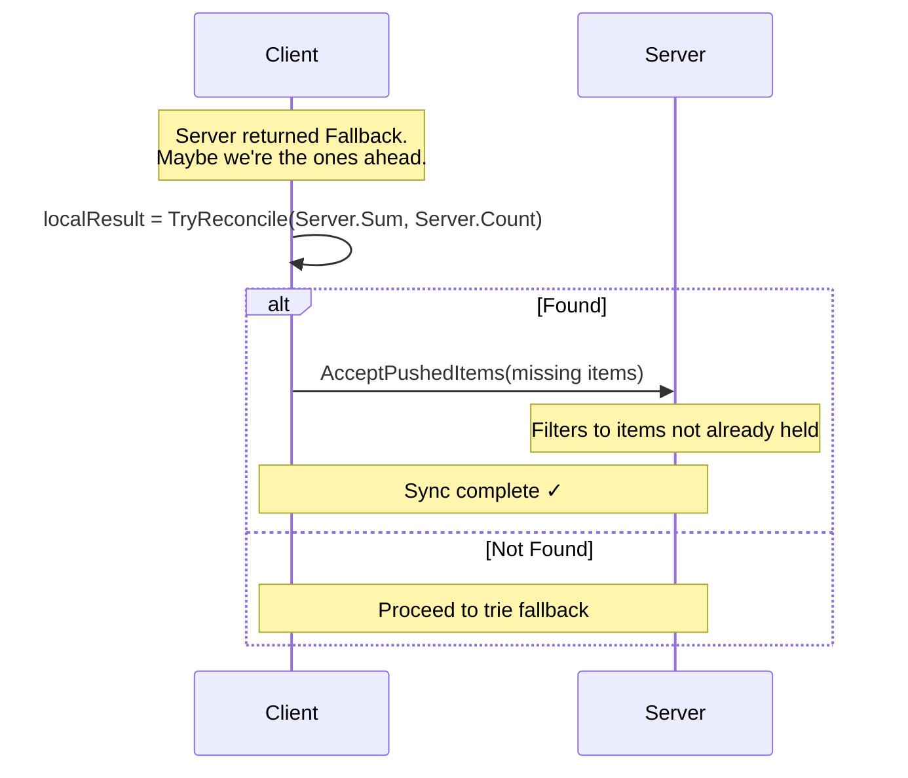
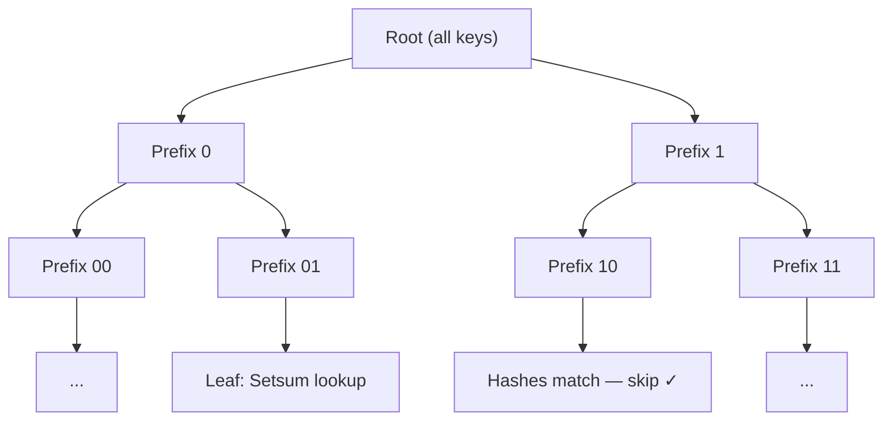
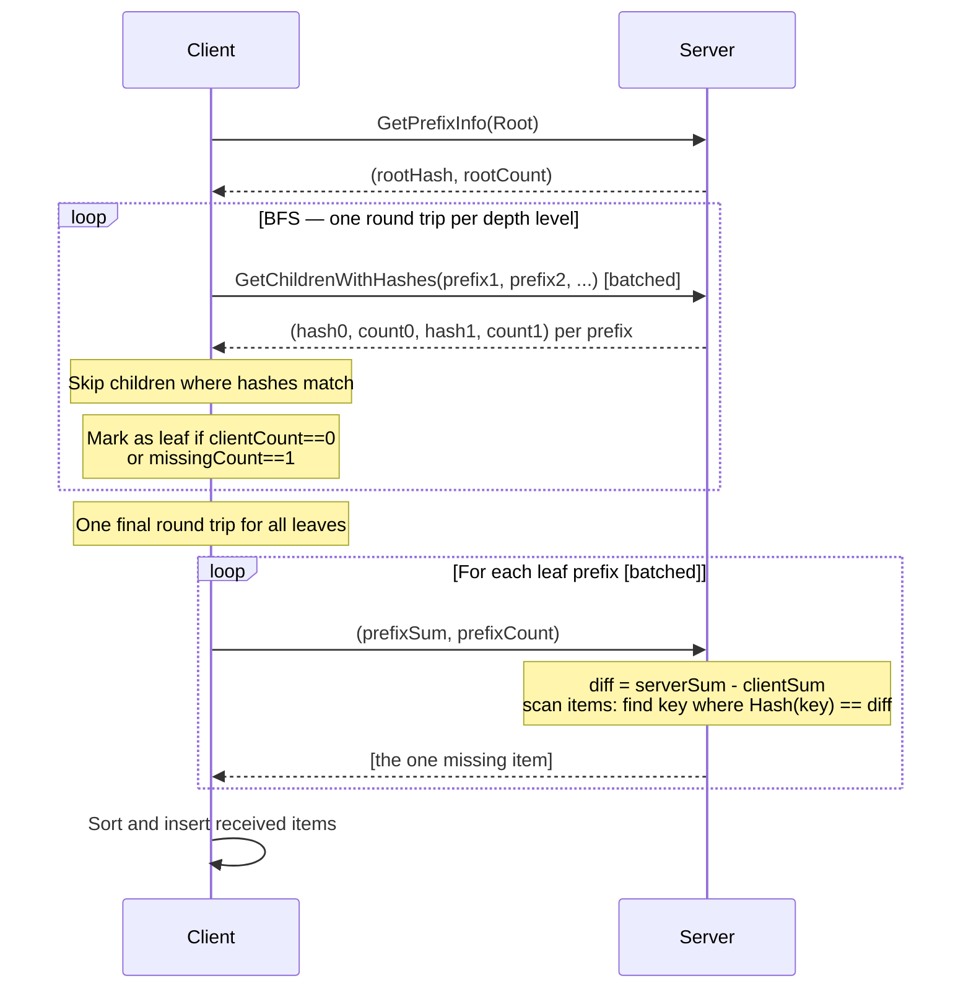
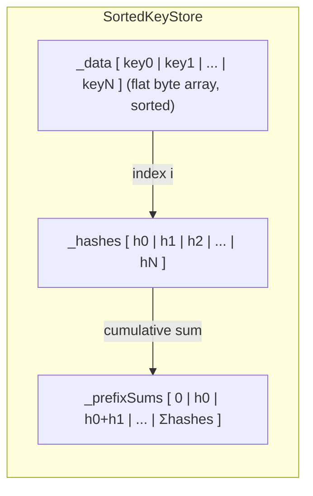
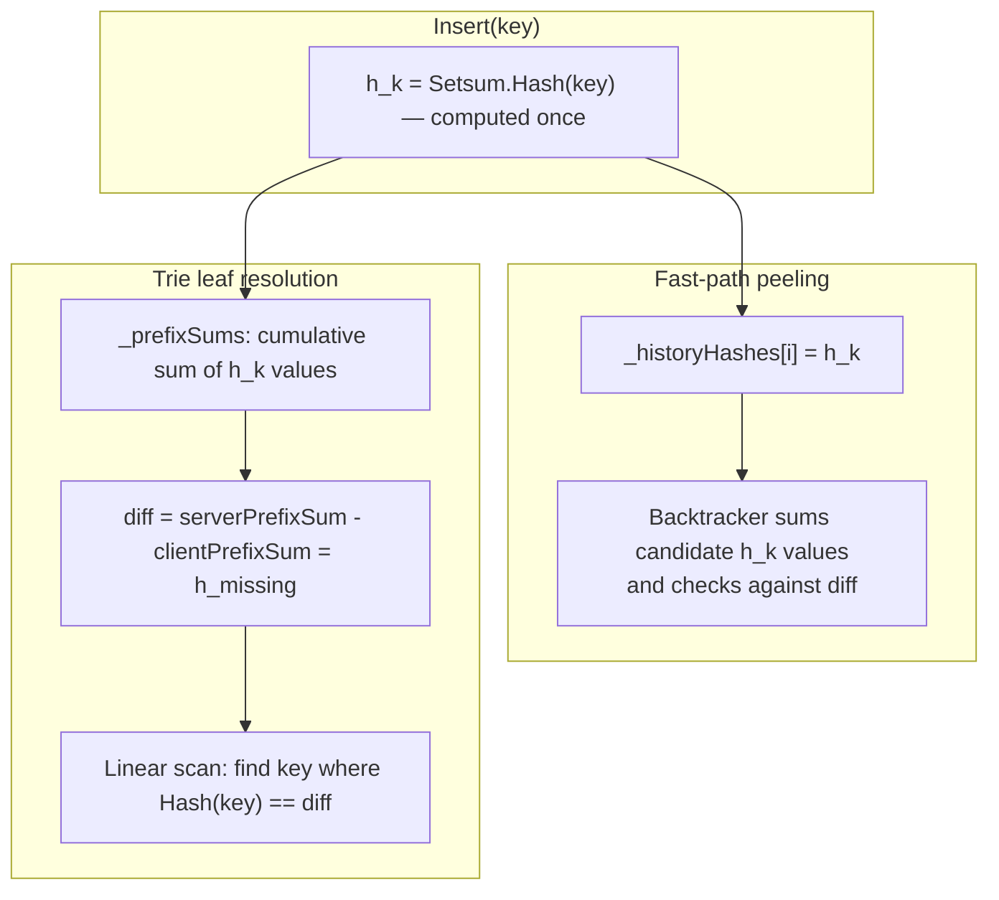
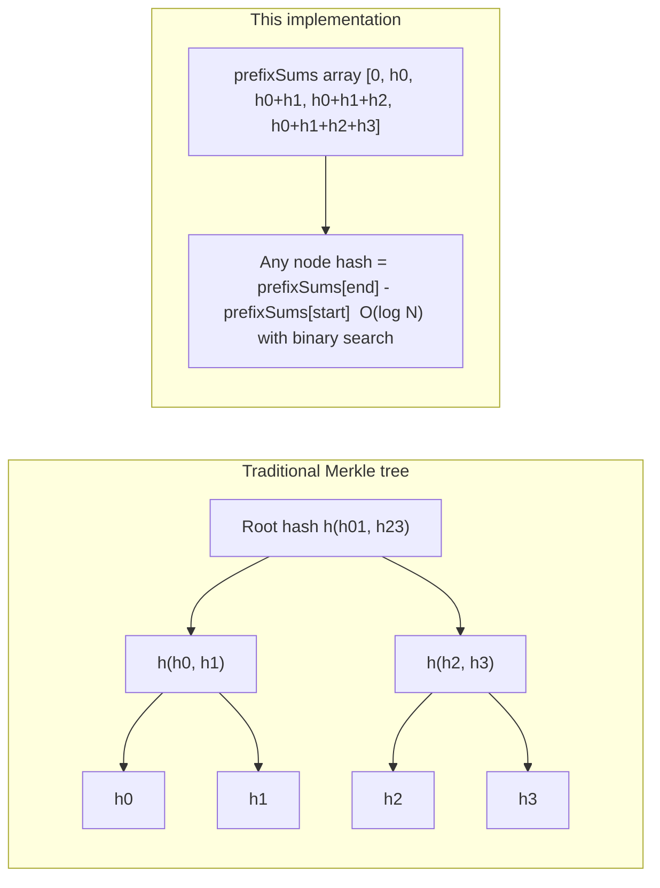

# Setsum Sync

A set-reconciliation library for efficiently synchronising two sets of 32-byte keys across a network. The protocol minimises round-trips by trying fast heuristic paths before falling back to a full binary-prefix trie traversal.

---

## Overview

The core challenge: two nodes each hold a set of 32-byte keys. They want to converge to the same set with as few network round-trips as possible, without transferring keys they already share.

The library solves this in three escalating strategies:

1. **Fast Path** — Setsum peeling (1 round-trip, works for tiny diffs)
2. **Push Path** — if the *client* is ahead, push its extras to the server (0–1 round-trips)
3. **Trie Fallback** — binary-prefix trie traversal for large diffs (O(log N) round-trips)

---

## Core Data Structure: Setsum

A `Setsum` is a commutative, invertible hash over a set of items. Its key properties are:

- **Additive**: `sum(A ∪ B) = sum(A) + sum(B)`
- **Invertible**: `sum(A) - sum(B) = sum(A \ B)` when B ⊆ A
- **Order-independent**: inserting items in any order gives the same sum

This allows the server to compute what a client is missing by subtraction alone — and at trie leaves, to identify the single missing item with one linear scan rather than a key exchange.

---

## The Three Sync Paths

### Path 1: Fast Path (Setsum Peeling)

The client sends its `(Sum, Count)` tuple to the server. The server subtracts to find the diff sum and count, then tries to identify the missing items by searching its recent insertion history.


**When it works:** The diff is ≤ 10 items and all missing items appear in the server's recent history (circular buffer of 128 entries).

**Peeling algorithm:** Recursive backtracking search over recent history. For diffs of ≤ 3 items it searches the full 128-entry history; for diffs of 4–10 items it limits to the 20 most recent entries.

---

### Path 2: Push Path

If the server returned `Fallback`, it might be because the *client* is ahead (has items the server lacks). The client runs `TryReconcile` in reverse — checking if the server's `(Sum, Count)` can be peeled against the client's history.



---

### Path 3: Trie Fallback

A binary-prefix trie traversal. Keys are compared bit-by-bit from the most significant bit. Each trie node covers all keys sharing a common bit-prefix. The client and server exchange `(Hash, Count)` for subtrees, recursing only into subtrees that differ, until each differing subtree contains exactly one missing item.



#### BFS traversal

The BFS processes one full depth level per round trip (level-batched). For each node, the server returns `(Hash, Count)` for both children. Children are enqueued only if the server and client hashes differ — identical subtrees are skipped immediately.

A node becomes a leaf when:
- `clientCount == 0` — client has nothing here; server sends all its items directly, or
- `missingCount == 1` — exactly one item is missing; resolved with a Setsum lookup (see below), or
- `prefix.Length >= MaxPrefixDepth` — maximum trie depth reached.

All leaf resolutions are batched into a single final round trip.



#### Leaf resolution via Setsum

At each leaf the client sends only `(prefixSum, prefixCount)` — 36 bytes. The server computes:

```
diff = serverPrefixSum - clientPrefixSum
```

Since `missingCount == 1`, `diff` equals exactly one item's hash. The server does one linear scan over its items under that prefix and returns the key whose hash matches `diff`. No key list is exchanged in either direction — only the 36-byte summary goes up and the 32-byte answer comes back.

For `clientCount == 0` the server simply returns all its items under the prefix directly, since there is no client sum to subtract from.

---

## Storage: `SortedKeyStore`

Keys are stored in a flat `byte[]` array sorted by lexicographic key order. A `Setsum[]` array holds the corresponding hash for each key, enabling O(log N) range-hash queries via prefix sums.



**Range query**: `RangeInfo(lo, hi)` binary-searches for `start` and `end`, then returns `prefixSums[end] - prefixSums[start]` in O(log N).

**Pending buffer**: New insertions go into an unsorted `_pending` buffer. It is radix-sorted and merged into the main store lazily on the next query — avoiding repeated O(N log N) sorts during bulk inserts.

**Radix sort**: Two-pass LSB radix sort on key bytes 0–1, followed by insertion sort within same-prefix buckets (~15 items each, all in L1 cache). This achieves O(N) sort with sequential memory access.

---

## Why Setsum Works for Trie Leaves

The Setsums used for fast-path peeling and the Setsums used as trie node hashes are **not independent** — they are just computed over different subsets of the data.

Every key `k` has exactly one per-item hash `h_k = Setsum.Hash(k)`, computed once on insertion. The trie node hash for any prefix is simply the sum of `h_k` over all keys under that prefix — recoverable in O(log N) from the prefix-sum array.

At a trie leaf where `missingCount == 1`:

```
diff = serverPrefixSum - clientPrefixSum = h_missing
```

The missing item's hash is isolated exactly. The server scans its prefix items and finds the key whose `Setsum.Hash(key) == diff` — no guessing, no backtracking, one pass.



### Implicit trie from a flat array

Because Setsum is additive and invertible, the full binary-prefix trie is implicitly encoded in `_prefixSums` — no tree nodes are materialised. Any subtree hash is recovered in O(log N) via two binary searches and one subtraction:



A traditional Merkle tree must store every internal node hash explicitly and rebalance on insert or delete. This design stores only the leaf hashes and their prefix sums — the same O(N) space — with no rebalancing: the trie structure is defined entirely by key ordering, so insertions are sorted merges and all subtree hashes update implicitly.

---

## Complexity Summary

| Scenario | Round Trips | Bytes | Notes |
|---|---|---|---|
| Sets are identical | 1 | 36 | Setsum comparison |
| Client missing ≤ 3 items | 1 | ~100 | Full history peel |
| Client missing 4–10 items | 1 | ~350 | Recent history peel |
| Client ahead by ≤ 10 items | 1 | ~350 | Bulk push |
| Large diff (D missing, N total) | O(log N) | O(D × log(N/D) × 72 + D × 68) | Trie BFS + Setsum leaf lookup |

For the typical case of D=1,000 missing items in N=1,000,000 total: ~20 round trips and ~180KB transferred, vs 32KB of actual data. The overhead is the BFS traversal cost — irreducible for any protocol that must locate D differences in an N-item set.

> **`LeafThreshold = 1`** — the BFS descends until exactly one item is missing per prefix, then uses a 36-byte Setsum exchange to identify it. **`MaxPrefixDepth = 64`** caps descent at 64 bits.

---

## Key Files

| File | Purpose |
|---|---|
| `ReconcilableSet.cs` | High-level set with fast-path peeling, trie delegation, and leaf resolution |
| `SortedKeyStore.cs` | Flat sorted array store with O(log N) range-hash via prefix sums |
| `BitPrefix.cs` | Bit-level trie prefix for binary-prefix traversal |
| `ReconcileResult.cs` | Discriminated union result type (`Identical / Found / Fallback`) |
| `SyncSimulator.cs` | Test harness simulating two-node sync, counting round-trips and bytes |