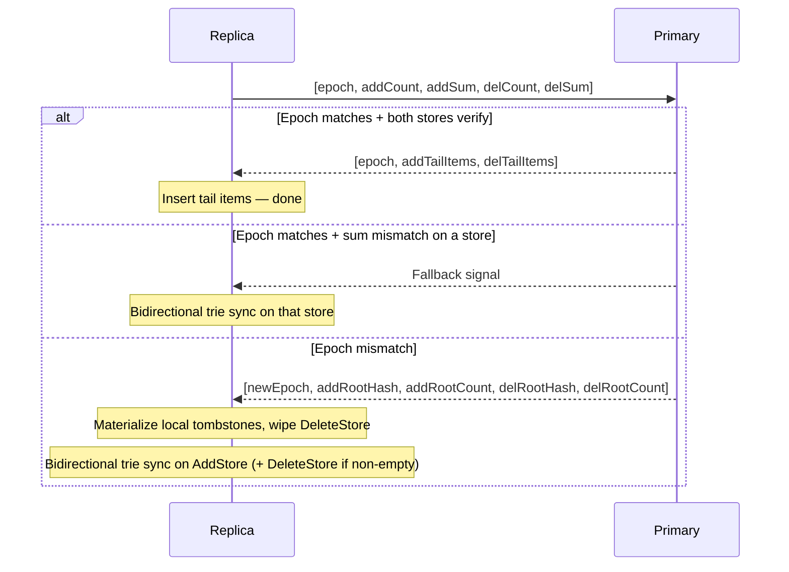
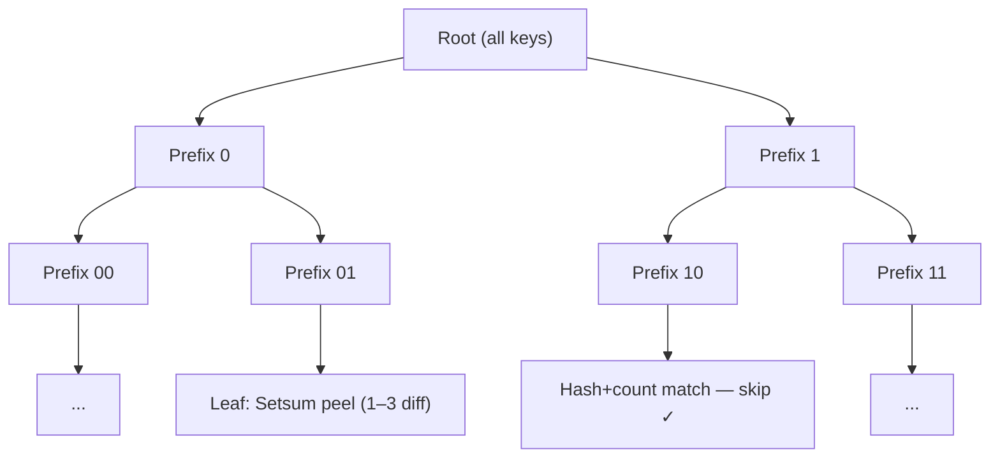

# Setsum Sync

A set-reconciliation library for efficiently synchronising two sets of 32-byte keys across a network. The protocol minimises round-trips by trying a sequence-based unidirectional fast path before falling back to a full bidirectional binary-prefix trie traversal.

This protocol assumes all participating nodes are mutually trusted — reported counts and sums are accepted at face value.

---

## Data Model

Each node owns two append-only stores and an epoch counter:

- **`AddStore`** — all inserted keys, synced primary→replica
- **`DeleteStore`** — tombstones for deleted keys, synced primary→replica
- **Effective membership** — `AddStore − DeleteStore`, computed at query time

Both stores are append-only, which keeps the protocol valid: the primary is always a superset of the replica within each store, so diffs are always non-negative within a store.

**Compaction** lets the primary periodically apply tombstones to `AddStore`, wipe `DeleteStore`, and increment `DeleteEpoch`. Without it, tombstones would accumulate forever. The epoch gives replicas an unambiguous signal that this happened, so they can recover before resuming normal sync. Without epochs you must either keep tombstones forever or risk silently missing deletes that were compacted before a replica synced.

---

## Core Data Structure: Setsum

A `Setsum` is a commutative, invertible hash over a set of items:

- **Additive**: `sum(A ∪ B) = sum(A) + sum(B)`
- **Invertible**: `sum(A) - sum(B) = sum(A \ B)` when B ⊆ A
- **Order-independent**: inserting items in any order gives the same sum

This lets the primary node compute what a replica is missing by subtraction alone — and at trie leaves, identify up to 3 missing items without a full key exchange.

---

## Sync Protocol

Every sync starts the same way: the replica sends its epoch and sequence state for both stores in a single message. The primary's response determines which path follows.

### Fast path

Every insert is numbered. Both stores maintain prefix sums over their insertion hashes. The primary verifies that `insertionPrefixSum[replicaCount] == replicaSum` — i.e. the replica holds exactly the first N items from the primary's history. If so, it sends only the tail.

This resolves any diff in 1 RT as long as the replica is simply behind — a diff of 1 item or 100,000 items is the same cost.

### Trie sync — the universal fallback

The trie sync is not specific to any one failure mode. It is the single repair mechanism for all forms of divergence:

- **Sum mismatch** — the replica has lost or gained items; the bidirectional trie finds and corrects all differences
- **Epoch mismatch** — the primary has compacted; the replica first materializes its local tombstones into `AddStore`, wipes `DeleteStore`, then runs the same bidirectional trie sync to converge both stores

After any trie sync, the replica resets its insertion-order tracking from its current store contents so the fast path works again on the next sync.

On epoch mismatch the primary piggybacks root `(hash, count)` for both stores in its response, so the trie BFS can start immediately with no extra round trip. If the delete store is empty after compaction (the common case), its sync is skipped entirely.

---

## Bidirectional Trie Sync

Keys are sorted by their bit representation; each trie node covers all keys sharing a common bit-prefix. The protocol exchanges subtree `(hash, count)` pairs level by level, recursing into subtrees where the two sides differ, until each is small enough to resolve directly.

Both directions are handled in a single BFS pass — additions and removals in the same traversal:

One round trip per depth level, batching all leaf resolutions and child expansions. A node becomes a leaf when:

- `primaryCount == 0` — replica's items are stale; removed locally with no wire traffic
- `replicaCount == 0` — primary sends all its items directly
- `|primaryCount − replicaCount| ≤ 3` — resolved via Setsum peeling
- `depth ≥ MaxPrefixDepth` — full key exchange

### Leaf resolution via Setsum peeling

**Primary ahead** (`signedDiff > 0`): Replica sends its prefix hash; primary subtracts to isolate the diff and identifies the 1–3 missing items by scanning its local hashes.

**Replica ahead** (`signedDiff < 0`): The primary's hash is already in scope from the expansion response. The replica peels locally — **zero wire cost**.

**Same count, different hash** (`signedDiff == 0`): Expanded further.

---

## Wire Protocol

All messages are binary with VarInt-encoded counts. Key = 32 B, Setsum = 32 B.

### Sequence request (replica → primary)

| Field | Size |
|---|---|
| epoch | 4 B |
| addCount | 4 B |
| addSum | 32 B |
| delCount | 4 B |
| delSum | 32 B |

**Total: 76 bytes.** Covers both stores in one round trip.

### Sequence response (primary → replica)

| Field | Size |
|---|---|
| epoch | 4 B |
| addOutcome | 1 B (0=Identical, 1=Found, 2=Fallback) |
| addPayload | varint(count) + count × 32 B keys (if Found) |
| delOutcome | 1 B |
| delPayload | varint(count) + count × 32 B keys (if Found) |

On epoch mismatch: `[newEpoch, addRootHash, addRootCount, delRootHash, delRootCount]` instead.

### Trie expansion (per BFS level)

**Request** (replica → primary): prefix bytes per child — `ceil(depth / 8)` bytes each.

**Response** (primary → replica): `varint(count) + 32 B hash` per child (hash omitted when count = 0).

### Leaf resolution (within the same BFS round trip)

| Case | Tx | Rx |
|---|---|---|
| replicaCount == 0 | prefix bytes | count × 32 B keys |
| signedDiff > 0 (primary ahead) | prefix + 32 B replicaHash | count × 32 B missing keys |
| signedDiff < 0 (replica ahead) | — | — (replica peels locally) |
| signedDiff == 0 | — | — (expanded further) |
| depth ≥ MaxPrefixDepth | prefix + count × 32 B replicaKeys | count × 32 B keys to add |

---

## Complexity

| Scenario | Round Trips | Notes |
|---|---|---|
| Sets identical | 1 | Sequence check covers both stores |
| Replica behind by D items | 1 | Tail send, any D |
| Sum mismatch (corruption) | 1 + O(log N) | 1 RT detects mismatch, trie sync repairs |
| Epoch mismatch (empty del store) | 1 + O(log N) | Root info piggybacked, delete store skipped |
| Epoch mismatch (non-empty del store) | 1 + O(log N) + O(log N) | Two trie passes, root info piggybacked |

---

## Key Files

| File | Purpose |
|---|---|
| `Setsum.cs` | Commutative, invertible 256-bit hash with SIMD arithmetic |
| `SortedKeyStore.cs` | Sorted flat array with O(log N) range-hash queries and Setsum peeling |
| `ReconcilableSet.cs` | Set with sequence-based fast path, insertion-order tracking, and trie leaf resolution |
| `SyncNodes.Triesync.cs` | Bidirectional trie BFS with combined leaf+expansion round trips |
| `SyncNodes.cs` | Sync orchestration and wire-byte accounting |
| `SyncableNode.cs` | Per-node add/delete stores, compaction, and epoch management |
| `BitPrefix.cs` | Bit-level trie prefix with multi-bit extension |