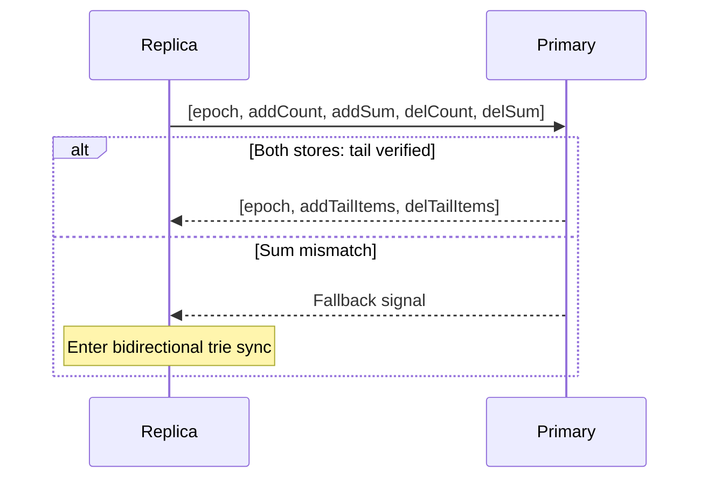
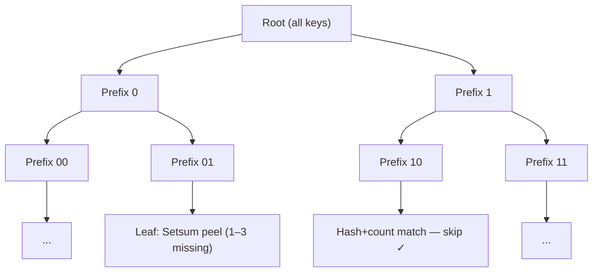
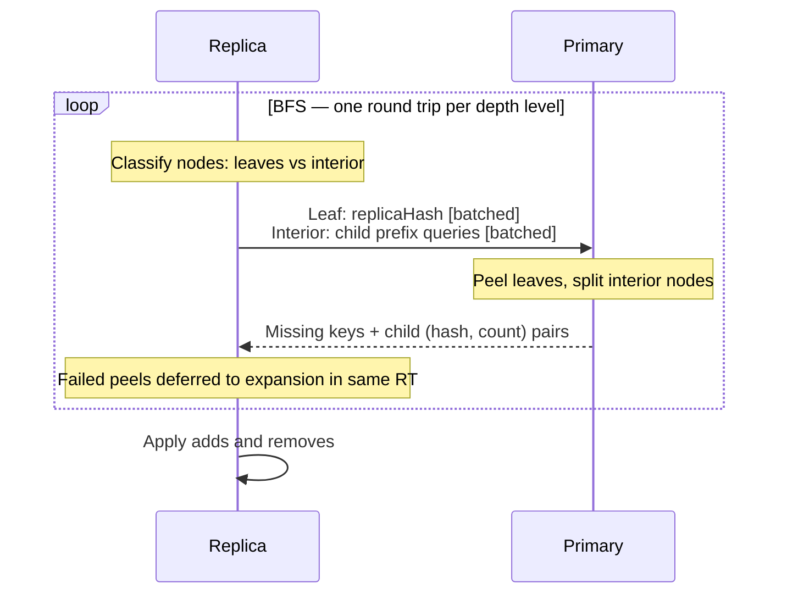
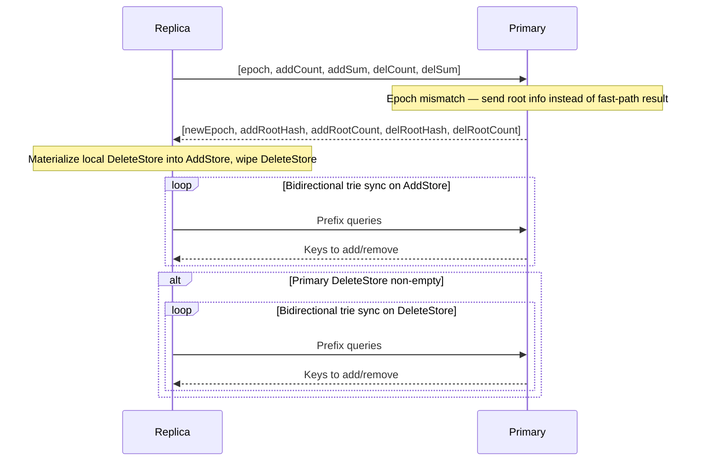

# Setsum Sync

A set-reconciliation library for efficiently synchronising two sets of 32-byte keys across a network. The protocol minimises round-trips by trying a sequence-based unidirectional fast path before falling back to a full bidirectional binary-prefix trie traversal.

This protocol assumes all participating nodes are mutually trusted — reported counts and sums are accepted at face value.

---

## Overview

Two nodes each hold a set of 32-byte keys. They want to converge to the same set with as few network round-trips as possible, without transferring keys they already share.

The library solves this in two escalating strategies:

1. **Fast Path** — Sequence-based tail send. Resolves any diff in 1 RT when the replica is simply behind.
2. **Trie Fallback** — Bidirectional binary-prefix trie traversal for arbitrary diffs.

---

## Core Data Structure: Setsum

A `Setsum` is a commutative, invertible hash over a set of items:

- **Additive**: `sum(A ∪ B) = sum(A) + sum(B)`
- **Invertible**: `sum(A) - sum(B) = sum(A \ B)` when B ⊆ A
- **Order-independent**: inserting items in any order gives the same sum

This lets the primary node compute what a replica is missing by subtraction alone — and at trie leaves, identify up to 3 missing items without a full key exchange.

---

## Path 1: Sequence-Based Fast Path

Every insert is numbered. Both stores maintain prefix sums over their insertion hashes.

The replica sends `(insertionCount, totalSum)` for each store. The primary checks that `insertionPrefixSum[replicaCount] == replicaSum` — i.e. the replica holds exactly the first N items from the primary's insertion history. If verified, the primary sends only the tail items.

**When it works:** The replica is an exact prefix of the primary's insertion history — regardless of how many items it's missing. A diff of 1 or 100,000 items both resolve in 1 RT.

**When it fails:** Any corruption or out-of-order mutation breaks the sum check and triggers trie sync. After repair the replica resets its insertion-order tracking so future fast paths work again.

---

## Path 2: Bidirectional Trie Sync (Fallback)

A bidirectional binary-prefix trie traversal. Keys are sorted by their bit representation; each trie node covers all keys sharing a common bit-prefix. The protocol exchanges subtree `(hash, count)` pairs, recursing into subtrees where the two sides differ, until each differing subtree is small enough to resolve directly.

Both directions are handled in a single BFS pass:
- Primary has items the replica doesn't → add to replica
- Replica has items the primary doesn't → remove from replica

### BFS traversal

One round trip per depth level, batching all leaf resolutions and child expansions together. A node becomes a leaf when:

- `primaryCount == 0` — replica's items are stale; removed locally with no wire traffic
- `replicaCount == 0` — primary sends all its items directly
- `|primaryCount − replicaCount| ≤ 3` — resolved via Setsum peeling
- `depth ≥ MaxPrefixDepth` — full key exchange

### Leaf resolution via Setsum peeling

**Primary ahead** (`signedDiff > 0`): Replica sends its prefix hash; primary subtracts to get the diff and identifies the 1–3 missing items by scanning its local hashes. No guessing — the diff isolates exactly which items are missing.

**Replica ahead** (`signedDiff < 0`): The primary's hash is already in scope from the expansion response. The replica peels locally to identify its 1–3 stale items — **zero wire cost**.

**Same count, different hash** (`signedDiff == 0`): Expanded further.

Because `absDiff` is known exactly, the peeling skips scan levels that can't match. For a 1-item diff only a linear scan runs; for a 2-item diff an O(n²) pair scan is added; for 3 items a hash-table probe is added on top.

---

## Wire Protocol

All messages are binary with VarInt-encoded counts. Key = 32 B, Setsum = 32 B.

### Sequence request (replica → primary)

| Field | Size |
|---|---|
| epoch | 4 B |
| addCount | 4 B |
| addSum | 32 B |
| delCount | 4 B |
| delSum | 32 B |

**Total: 76 bytes.** Covers both stores in one round trip.

### Sequence response (primary → replica)

| Field | Size |
|---|---|
| epoch | 4 B |
| addOutcome | 1 B (0=Identical, 1=Found, 2=Fallback) |
| addPayload | varint(count) + count × 32 B keys (if Found) |
| delOutcome | 1 B |
| delPayload | varint(count) + count × 32 B keys (if Found) |

On epoch mismatch the primary skips the fast-path evaluation and responds instead with `[newEpoch, addRootHash, addRootCount, delRootHash, delRootCount]` — piggybacking root info for both stores so the BFS can start immediately.

### Trie expansion (per BFS level)

**Request** (replica → primary): prefix bytes per child — `ceil(depth / 8)` bytes each.

**Response** (primary → replica): `varint(count) + 32 B hash` per child (hash omitted when count = 0).

### Leaf resolution (within the same BFS round trip)

| Case | Tx | Rx |
|---|---|---|
| replicaCount == 0 | prefix bytes | count × 32 B keys |
| signedDiff > 0 (primary ahead) | prefix + 32 B replicaHash | count × 32 B missing keys |
| signedDiff < 0 (replica ahead) | — | — (replica peels locally) |
| signedDiff == 0 | — | — (expanded further) |
| depth ≥ MaxPrefixDepth | prefix + count × 32 B replicaKeys | count × 32 B keys to add |

---

## Complexity

| Scenario | Round Trips | Notes |
|---|---|---|
| Sets identical | 1 | Sequence check covers both stores |
| Replica behind by D items | 1 | Tail send, any D |
| Replica corrupted | 1 + O(log N) | 1 RT detects mismatch, BFS repairs |
| Epoch mismatch (empty del store) | 1 + O(log N) | Root info piggybacked, delete store skipped |
| Epoch mismatch (non-empty del store) | 1 + O(log N) + O(log N) | Two BFS passes, root info piggybacked |

---

## Delete Protocol

### Data Model

Each node owns two append-only stores:

- **`AddStore`** — all inserted keys, synced primary→replica
- **`DeleteStore`** — tombstones for deleted keys, synced primary→replica
- **Effective membership** — `AddStore − DeleteStore`, computed at query time

Both stores are strictly append-only, which keeps the protocol valid across compactions.

### Epochs

`DeleteStore` tombstones would grow forever without compaction. When the primary compacts — applying all tombstones to `AddStore`, wiping `DeleteStore`, and incrementing `DeleteEpoch` — replicas detect the epoch change and recover before resuming normal sync.

Without epochs you must either keep tombstones forever or risk replicas silently missing deletes that were compacted before they synced.

### Epoch-Mismatch Recovery

The primary piggybacks root info for both stores in the mismatch response, so no extra round trips are needed to start the BFS. If the delete store is empty after compaction (the common case), its sync is skipped entirely.

---

## Key Files

| File | Purpose |
|---|---|
| `Setsum.cs` | Commutative, invertible 256-bit hash with SIMD arithmetic |
| `SortedKeyStore.cs` | Sorted flat array with O(log N) range-hash queries and Setsum peeling |
| `ReconcilableSet.cs` | Set with sequence-based fast path, insertion-order tracking, and trie leaf resolution |
| `SyncNodes.Triesync.cs` | Bidirectional trie BFS with combined leaf+expansion round trips |
| `SyncNodes.cs` | Sync orchestration and wire-byte accounting |
| `SyncableNode.cs` | Per-node add/delete stores, compaction, and epoch management |
| `BitPrefix.cs` | Bit-level trie prefix with multi-bit extension |
| `ReconcileResult.cs` | Discriminated union: `Identical / Found / Fallback` |
