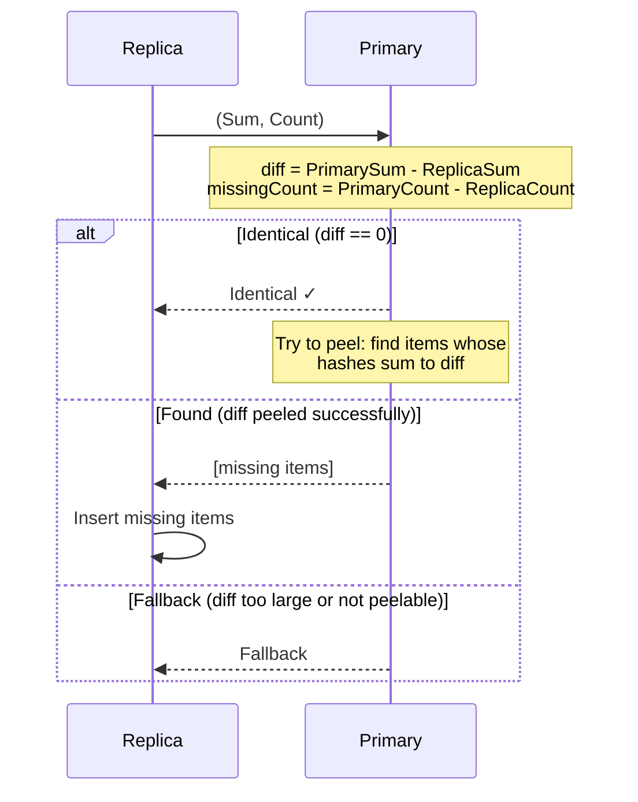
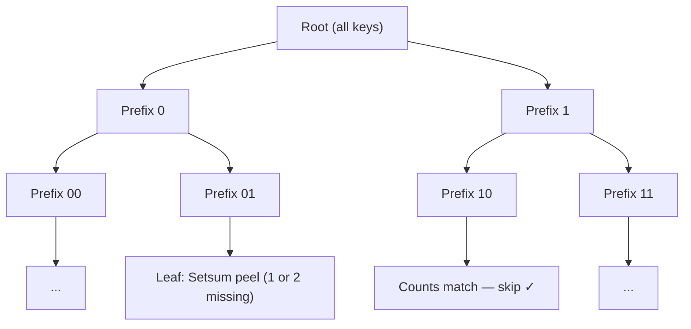
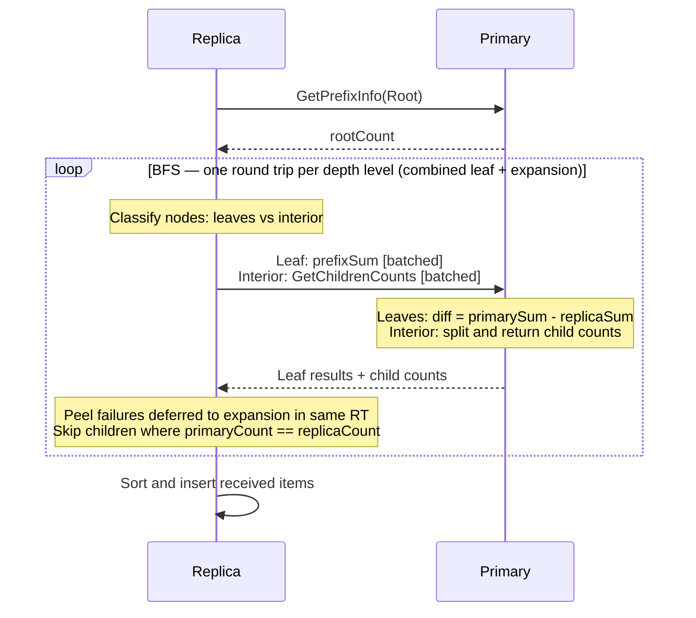
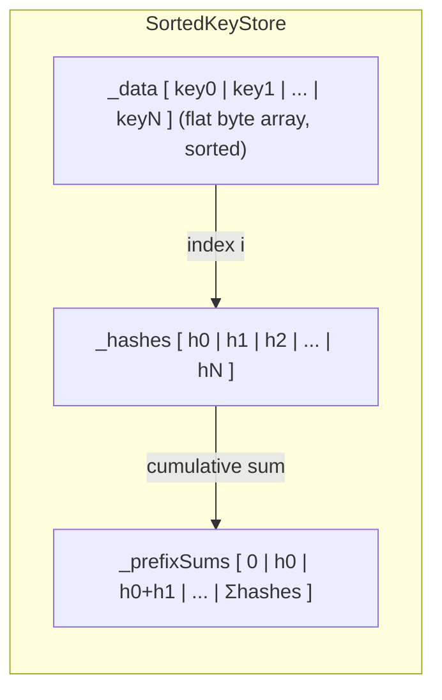
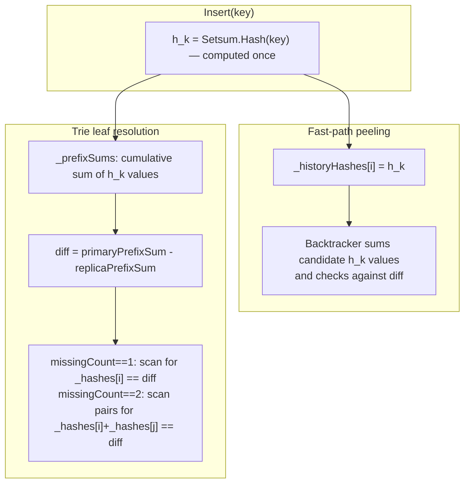
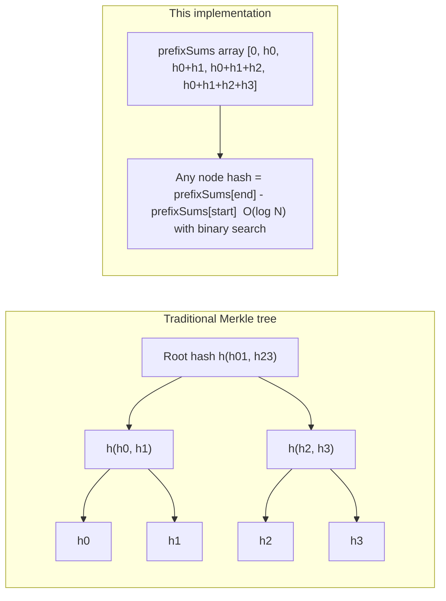
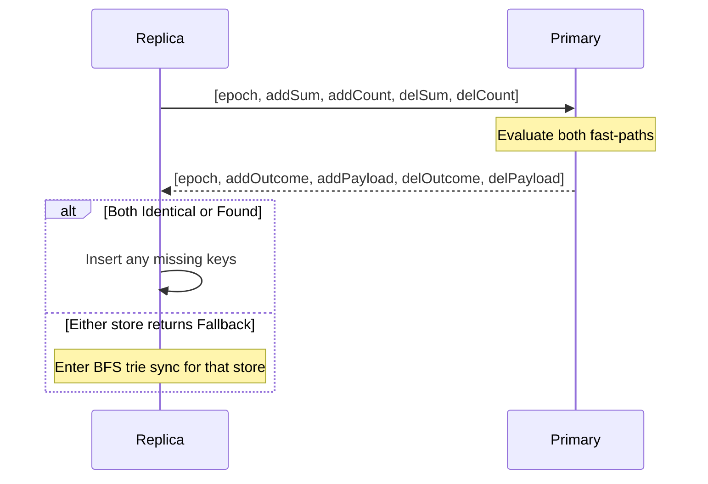
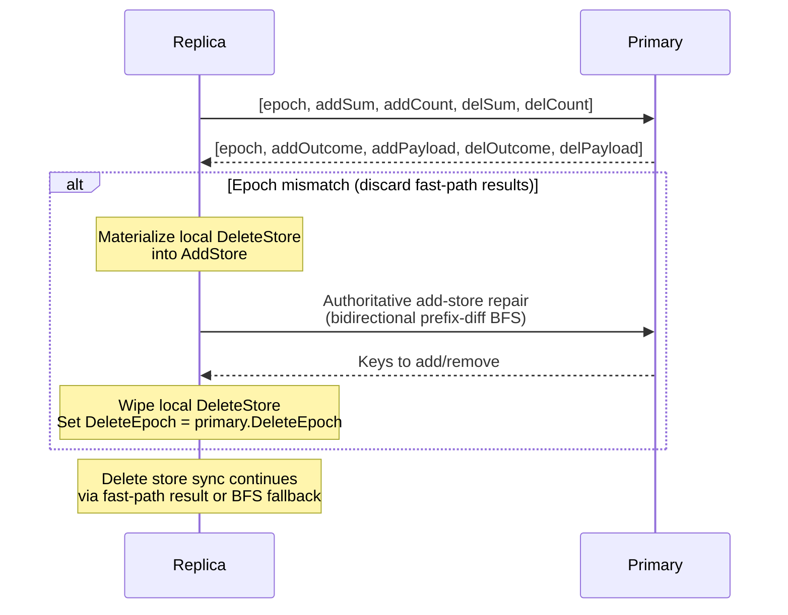

# Setsum Sync

A set-reconciliation library for efficiently synchronising two sets of 32-byte keys across a network. The protocol minimises round-trips by trying fast heuristic paths before falling back to a full binary-prefix trie traversal.

This protocol assumes all participating nodes are mutually trusted. The reported counts and sums are accepted at face value. A malicious node could trigger expensive computations. The upside is that this setup allows for a lot of optimizations.

---

## Overview

The core challenge: two nodes each hold a set of 32-byte keys. They want to converge to the same set with as few network round-trips as possible, without transferring keys they already share.

The protocol is **unidirectional** — the primary node transfers items it has to the replica. It does not support the case where both sides are ahead of each other. The BFS uses `missingCount = primaryCount - replicaCount` to decide when to stop descending, so when both sides have extra items under a prefix the counts partially cancel — a prefix where the primary has 5 extras and the replica has 5 extras looks like `missingCount == 0` and gets skipped entirely, silently dropping all 10 differences.

The library solves this in two escalating strategies:

1. **Fast Path** — Setsum peeling (works for tiny diffs, evaluated as part of the combined epoch+fast-path round trip)
2. **Trie Fallback** — binary-prefix trie traversal for large diffs (1 RT per BFS depth level)

---

## Core Data Structure: Setsum

A `Setsum` is a commutative, invertible hash over a set of items. Its key properties are:

- **Additive**: `sum(A ∪ B) = sum(A) + sum(B)`
- **Invertible**: `sum(A) - sum(B) = sum(A \ B)` when B ⊆ A
- **Order-independent**: inserting items in any order gives the same sum

This allows the primary to compute what a replica is missing by subtraction alone — and at trie leaves, to identify up to 2 missing items without a key exchange.

---

## The Two Sync Paths

### Path 1: Fast Path (Setsum Peeling)

The replica sends its `(Sum, Count)` tuple to primary. The primary subtracts to find the diff sum and count, then tries to identify the missing items by searching its recent insertion history.



**When it works:** The diff is ≤ 10 items and all missing items appear in the primary's recent history (circular buffer of 128 entries).

**Peeling algorithm:** Recursive backtracking search over recent history. For diffs of ≤ 3 items it searches the full 128-entry history; for diffs of 4–10 items it limits to the 20 most recent entries.

---

### Path 2: Trie Fallback

A binary-prefix trie traversal. Keys are compared bit-by-bit from the most significant bit. Each trie node covers all keys sharing a common bit-prefix. The replica and primary exchange subtree counts, recursing only into subtrees where the primary has more items than the replica, until each differing subtree is small enough to resolve via Setsum peeling.

Because the protocol is unidirectional, **counts alone are sufficient to prune the trie** — no hashes are exchanged during normal BFS traversal. `primaryCount == replicaCount` guarantees the subtrees are identical (primary is always a superset, so equal counts imply equal sets); `primaryCount > replicaCount` means the primary has items the replica is missing.



#### BFS traversal

The BFS processes one full depth level per round trip (level-batched). For each node, the primary returns the counts for both children. Children are enqueued only if `primaryCount > replicaCount` — equal counts mean identical subtrees and are skipped immediately.

A node becomes a leaf when:
- `replicaCount == 0` — replica has nothing here; primary sends all its items directly, or
- `missingCount <= 2` — at most two items are missing; resolved via Setsum peeling (see below), or
- `prefix.Length >= MaxPrefixDepth` — maximum trie depth reached.

All leaf resolutions and child-count expansions are batched into a **single combined round trip per BFS level** — leaf resolution and expansion happen in the same RT rather than two separate ones. If a leaf's primary-side prefix is too large for pair peeling, it is deferred to the expansion pass within the same round trip rather than dropped.



#### Leaf resolution via Setsum peeling

At each leaf the replica sends only its `prefixSum` — 32 bytes. The primary computes:

```
diff = primaryPrefixSum - replicaPrefixSum
```

**missingCount == 1:** `diff` equals exactly one item's hash. The primary does one linear scan over its items under that prefix and returns the matching key. No key list is exchanged — only the 32-byte summary goes up and the single key comes back.

**missingCount == 2:** `diff` equals the sum of exactly two items' hashes. The primary tries all O(n²) pairs of items under the prefix, checking whether `hash[i] + hash[j] == diff`. This is only attempted when the primary holds at most `MaxPrimaryCountForPairPeel` (512) items under that prefix, keeping the search space bounded (≤ 262,144 pairs). If the prefix is larger the primary returns `Fallback` and the replica descends further.

For `replicaCount == 0` the primary simply returns all its items under the prefix directly, since there is no replica sum to subtract from.

Both scans read directly from the stored `_hashes[]` array in `SortedKeyStore` — no re-hashing of keys is performed, and no key copies are allocated until a match is confirmed.

---

## Storage: `SortedKeyStore`

Keys are stored in a flat `byte[]` array sorted by lexicographic key order. A `Setsum[]` array holds the corresponding hash for each key, enabling O(log N) range-hash queries via prefix sums.



**Range query**: `RangeInfo(lo, hi)` binary-searches for `start` and `end`, then returns `prefixSums[end] - prefixSums[start]` in O(log N).

**Peeling scan**: `TryPeelRange(lo, hi, diff, maxCount)` walks `_hashes[start..end]` directly for both the linear (missingCount==1) and pair (missingCount==2) scans. Keys are only copied off `_data` when a match is confirmed — the miss path allocates nothing.

**Pending buffer**: New insertions go into an unsorted `_pending` buffer. It is radix-sorted and merged into the main store lazily on the next query — avoiding repeated O(N log N) sorts during bulk inserts.

**Radix sort**: Four-pass LSB radix sort on key bytes 0–3, followed by insertion sort within same-prefix buckets (average <1 item for N ≤ 4 billion, so effectively a no-op). This achieves O(N) sort with sequential memory access.

---

## Why Setsum Works for Trie Leaves

The Setsums used for fast-path peeling and the Setsums used at trie leaves for `missingCount <= 2` resolution are **not independent** — they are just computed over different subsets of the data. During BFS traversal no hashes are exchanged at all; Setsums only appear at leaves where the replica sends its `prefixSum` for primary to peel against.

Every key `k` has exactly one per-item hash `h_k = Setsum.Hash(k)`, computed once on insertion. The trie node hash for any prefix is simply the sum of `h_k` over all keys under that prefix — recoverable in O(log N) from the prefix-sum array.

At a trie leaf where `missingCount == 1`:

```
diff = primaryPrefixSum - replicaPrefixSum = h_missing
```

The missing item's hash is isolated exactly. The primary node scans its prefix items and finds the key whose `Setsum.Hash(key) == diff` — no guessing, no backtracking, one pass.

At a trie leaf where `missingCount == 2`:

```
diff = primaryPrefixSum - replicaPrefixSum = h_missing1 + h_missing2
```

Primary tries all pairs `(i, j)` and checks `_hashes[i] + _hashes[j] == diff`. Both scans reuse the hashes already computed on insertion — `Setsum.Hash` is never called during leaf resolution.



### Implicit trie from a flat array

Because Setsum is additive and invertible, the full binary-prefix trie is implicitly encoded in `_prefixSums` — no tree nodes are materialised. Any subtree hash is recovered in O(log N) via two binary searches to find the range boundaries, and one O(1) subtraction `prefixSums[end] - prefixSums[start]`.

This is only needed at leaves: during BFS traversal counts alone drive the descent, so no subtree hashes are exchanged at all. Hashes only appear at leaves where the replica sends its `prefixSum` and the primary computes `primaryPrefixSum` for that prefix to peel against.



A traditional Merkle tree must store every internal node hash explicitly and rebalance on insert or delete. This design stores only the leaf hashes and their prefix sums — the same O(N) space — with no rebalancing: the trie structure is defined entirely by key ordering, so insertions are sorted merges and all subtree hashes update implicitly.

---

## Complexity Summary

| Scenario | Round Trips | Bytes | Notes |
|---|---|---|---|
| Sets are identical | 1 | ~70 | Combined epoch + both fast-paths in single RT |
| Replica missing ≤ 3 items | 1 | ~170 | Combined RT; fast-path resolves both stores |
| Replica missing 4–10 items | 1 | ~390 | Combined RT; fast-path resolves both stores |
| Large diff (D missing, N total) | 1 + O(log N) | O(D × log(N/D) + D × 32) | 1 combined RT (epoch + fast-path fallback) + level-batched BFS with 1 RT per depth level |

The epoch handshake and both store fast-paths are pipelined into a **single combined round trip**. The replica sends `[epoch, addSum, addCount, delSum, delCount]` and the primary responds with `[epoch, addOutcome, addPayload, delOutcome, delPayload]`. If both stores resolve via fast-path, the entire sync completes in 1 RT. If either store falls back, only that store enters BFS.

Within the BFS, leaf resolution and child-count expansion are combined into a **single RT per depth level**, so the total trip count is bounded by the trie depth — O(log N) — not by the number of differing items. For D=10,000 missing items in N=1,000,000 total: ~22 round trips and ~575 KB transferred. The raw diff is 320 KB; total store size is 32 MB.

The BFS nodes carry pre-computed store indices for **both** primary `(PrimaryStart, PrimaryEnd)` and replica `(ReplicaStart, ReplicaEnd)` through each level. Child splits reuse the parent's bounds via a single O(log range) scan rather than a full O(log N) binary search from scratch, eliminating binary searches on both sides during traversal.

---

## Delete Protocol

Set reconciliation alone is not enough: a key the primary has removed should eventually disappear from replicas too. Deletes are tracked separately so removals can be synced with the same unidirectional guarantees as insertions, without complicating the trie protocol.
### Data Model

Each node owns two append-only stores:

- **`AddStore`** — all inserted keys, synced primary→replica. Never mutated by deletes.
- **`DeleteStore`** — tombstones for deleted keys, synced primary→replica.
- **Effective membership** — `AddStore − DeleteStore`, computed at query time.

Both stores are strictly append-only. This keeps the unidirectional trie sync valid across compactions: the primary is always a superset of the replica within each store.

### Why Epochs Exist

`DeleteStore` tombstones would grow forever without compaction. Epochs let the primary compact safely while giving replicas an unambiguous signal that compaction occurred.

Without epochs you must either keep tombstones forever, or risk replicas silently missing deletes that were compacted before they synced.

### Primary Compaction

Compaction works by applying all pending tombstones to `AddStore`, wiping `DeleteStore`, and incrementing `DeleteEpoch`.

### Normal Sync Flow (No Epoch Mismatch)



The epoch handshake and both store fast-paths are pipelined into a single round trip. After both stores sync, the effective set (`AddStore − DeleteStore`) is consistent at query time. Tombstones are not physically applied to `AddStore` on the normal path — the subtraction is computed dynamically.

### Epoch-Mismatch Recovery

If `replica.DeleteEpoch != primary.DeleteEpoch`, the replica's `DeleteStore` may reference tombstones the primary has already compacted away. The replica recovers before resuming normal sync:



The repair phase uses a **bidirectional** binary-prefix trie traversal that handles both directions in a single BFS pass: keys the replica is missing (primary added new items) and keys the replica holds that the primary has compacted away. Because the primary is the authority after compaction, its view of `AddStore` is definitive.

Unlike the normal unidirectional BFS which exchanges counts only, the epoch repair BFS exchanges `(hash, count)` per node — hashes are required to detect divergence when counts are equal but items differ (i.e. an equal number of adds and removes under a prefix). Each BFS level uses a single round trip that batches both leaf resolution and child expansion together.

---

## Key Files

| File | Purpose |
|---|---|
| `ReconcilableSet.cs` | High-level set with fast-path peeling, trie delegation, and leaf resolution |
| `SortedKeyStore.cs` | Flat sorted array store with O(log N) range-hash and zero-allocation peeling scan |
| `BitPrefix.cs` | Bit-level trie prefix for binary-prefix traversal |
| `ReconcileResult.cs` | Discriminated union result type (`Identical / Found / Fallback`) |
| `SyncNodes.cs` | Syncs a primary node with a replicate, counting time, round-trips and bytes |
| `SyncableNode.cs` | Per-node add/delete stores, compaction, and epoch management |