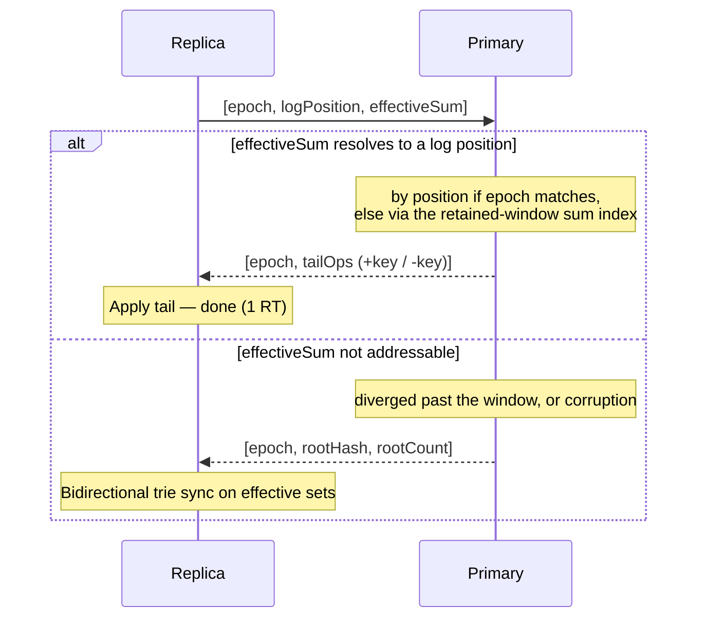
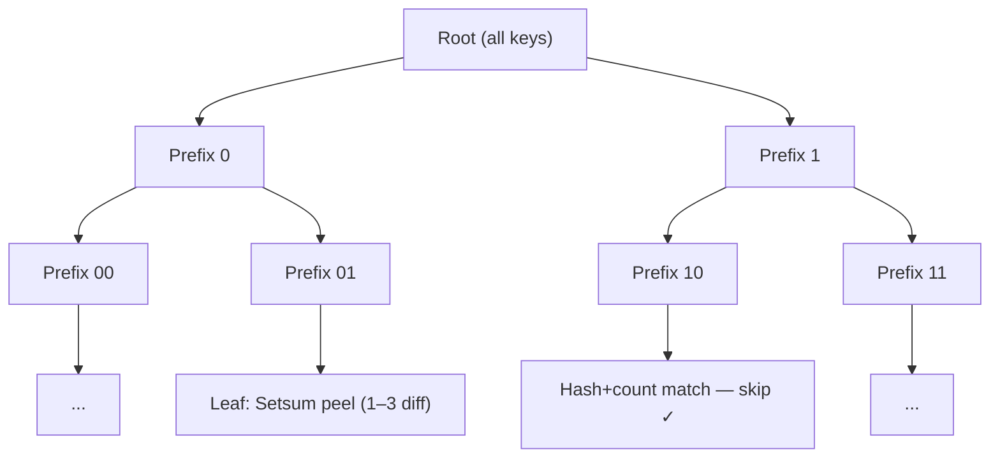

# Setsum Sync

A unidirectional, stateless set-reconciliation protocol for efficiently synchronising two sets of 32-byte keys across a network. Sync always flows **primary → replica**: the primary is the authoritative owner of the set, and replicas converge to it. The primary keeps **no per-replica state** — every sync is self-describing because the replica sends its own position and checksum in a single message.

The protocol minimises round-trips by trying a **sum-addressable** fast path before falling back to a binary-prefix trie traversal. The fast path resolves the replica's state by the *content* of its set — its effective sum — rather than by a log position that a compaction would invalidate, so a replica that is only a little behind fast-paths in a single round trip even across a compaction. The trie traversal itself is bidirectional (it discovers items to add *and* remove from the replica in a single pass), but the sync direction is always primary → replica.

This protocol assumes all participating nodes are mutually trusted — reported counts and sums are accepted at face value.

---

## Data Model

Both the primary and each replica maintain their own independent copy of the same structures:

- **Operation log** — an ordered sequence of inserts (`+key`) and deletes (`-key`), with prefix sums tracking the effective setsum at each position
- **Sum index** — a sliding window over the most recent operations mapping each effective sum → its log position. This is what makes the fast path sum-addressable: a replica is matched by what its set *contains*, so the match survives a compaction that renumbers positions. It is per-set state (one window per set), not per-replica, so statelessness with respect to who is syncing is preserved
- **Effective set** — the current membership set, maintained as a sorted store for trie-based queries
- **Epoch** — incremented on compaction; lets a replica tell that the log was re-sequenced so it does not trust a raw position number across the bump

The setsum's invertibility means prefix sums work naturally over mixed operations:

```
Log:       [+A, +B, -A, +C]
PrefixSum: [H(A), H(A)+H(B), H(B), H(B)+H(C)]
```

The prefix sum at any position is the setsum of the effective set at that point.

The primary's log is authoritative. A replica's log tracks its own view — during sync, the replica sends `(epoch, logPosition, effectiveSum)` and the primary responds purely from its own log, sum index, and effective set, with no memory of any previous sync. This means any number of replicas can sync independently, and a replica that goes offline for an arbitrary period simply resumes from wherever it left off.

**Compaction** trims the log to a recent window of the most recent `SumIndexWindow` operations (default 1,024) and increments the epoch. Crucially it keeps the *real* recent op history — actual adds and deletes, not a flat list of all-inserts — and rebuilds the sum index over the retained window. A replica whose effective sum still lands in that window therefore fast-paths *across* the compaction in one round trip; only a replica that has diverged further than the window falls back to a trie sync over effective membership. The window bounds per-set memory (a few tens of KB) and is the single lever trading memory for how far behind a replica can be and still bridge a compaction.

---

## Core Data Structure: Setsum

A `Setsum` is a commutative, invertible hash over a set of items:

- **Additive**: `sum(A ∪ B) = sum(A) + sum(B)`
- **Invertible**: `sum(A) - sum(B) = sum(A \ B)` when B ⊆ A
- **Order-independent**: inserting items in any order gives the same sum

This lets the primary node compute what a replica is missing by subtraction alone — and at trie leaves, identify up to 3 missing items without a full key exchange.

---

## Sync Protocol

Every sync is initiated by the replica. It sends its epoch, log position, and effective-set sum in a single message — this fully describes the replica's state without the primary needing to remember anything about it. The primary tries to resolve that effective sum to one of its own log positions; if it can, the diff is the tail from there. Otherwise it falls back to the trie.



### Fast path

The primary resolves the replica's effective sum to a log position two ways, in order:

1. **By position** — when the replica shares the primary's epoch, their log positions line up (same op history, no compaction has re-sequenced them), so the primary checks `prefixSum[replicaLogPosition] == replicaEffectiveSum` directly. This is unbounded: a replica arbitrarily far behind *in the same epoch* still resolves in O(1).
2. **By sum** — otherwise the primary looks the sum up in its retained-window index. Because the address is the set's content, this resolves even across a compaction (epoch bump), as long as the replica is within `SumIndexWindow` operations of the primary.

Either way it then sends the tail operations from that position — both adds and deletes in one stream. A diff of 1 item or 100,000 items in the same epoch is the same cost. Deletes flow through the exact same fast path as adds.

### Trie sync — the universal fallback

The trie sync is not specific to any one failure mode. It is the single repair mechanism for all forms of divergence the fast path cannot address:

- **Sum mismatch** — the replica has lost or gained items (corruption); its sum matches no position in the primary's log, so the bidirectional trie finds and corrects all differences
- **Diverged past the window** — the primary has compacted *and* the replica is more than `SumIndexWindow` operations behind, so its sum has been evicted from the index; one trie sync over effective sets converges both sides

A replica that compacted past but is still *within* the window never reaches here — it fast-paths across the compaction. After any trie sync, the replica rebuilds its operation log (and sum index) from its current effective set so the fast path works again on the next sync.

When the fast path fails, the primary piggybacks root `(hash, count)` for the effective set in the same response, so the trie BFS can start immediately with no extra round trip.

---

## Trie Sync (Fallback)

Keys are sorted by their bit representation; each trie node covers all keys sharing a common bit-prefix. The protocol exchanges subtree `(hash, count)` pairs level by level, recursing into subtrees where the two sides differ, until each is small enough to resolve directly.

The traversal is bidirectional in the sense that it discovers differences in both directions — items the replica is missing (added from primary) and items the replica has that the primary doesn't (removed from replica) — but the goal is always to converge the replica to the primary's state:



One round trip per depth level, batching all leaf resolutions and child expansions. A node becomes a leaf when:

- `primaryCount == 0` — replica's items are stale; removed locally with no wire traffic
- `replicaCount == 0` — primary sends all its items directly
- `|primaryCount − replicaCount| ≤ 3` — resolved via Setsum peeling
- `depth ≥ MaxPrefixDepth` — full key exchange (both adds **and** removes)

`MaxPrefixDepth` is 64: the trie discriminates on the first 64 bits of each key, which assumes keys are uniformly distributed there (digests/hashes). Divergent leaves then isolate far above that bound. Any keys that share a full 64-bit prefix collapse into a single depth-64 leaf, reconciled by a direct full key exchange — correct, but without the trie's bandwidth savings, so structured keys with long shared prefixes are out of scope.

### Leaf resolution via Setsum peeling

**Primary ahead** (`signedDiff > 0`): Replica sends its prefix hash; primary subtracts to isolate the diff and identifies the 1–3 missing items by scanning its local hashes.

**Replica ahead** (`signedDiff < 0`): The primary's hash is already in scope from the expansion response. The replica peels locally — **zero wire cost**.

**Same count, different hash** (`signedDiff == 0`): Expanded further.

---

## Wire Protocol

All messages are binary with VarInt-encoded counts. Key = 32 B, Setsum = 32 B.

### Sequence request (replica → primary)

| Field | Size |
|---|---|
| epoch | varint |
| logPosition | varint |
| effectiveSum | 32 B |

Covers everything in one round trip.

### Sequence response (primary → replica)

**Fast path success:**

| Field | Size |
|---|---|
| epoch | varint |
| opCount | varint |
| flags | ⌈opCount / 8⌉ B (1 bit per op: 1 = add, 0 = delete) |
| keys | opCount × 32 B |

Flags are packed as a bitfield — one bit per operation.

**Fallback (sum not addressable — corruption, or diverged past the window):**

| Field | Size |
|---|---|
| epoch | varint |
| rootHash | 32 B |
| rootCount | varint |

Followed by trie sync rounds.

### Trie expansion (per BFS level)

**Request** (replica → primary): prefix bytes per child — `ceil(depth / 8)` bytes each.

**Response** (primary → replica): `varint(count) + 32 B hash` per child (hash omitted when count = 0).

### Leaf resolution (within the same BFS round trip)

| Case | Tx | Rx |
|---|---|---|
| replicaCount == 0 | prefix bytes | count × 32 B keys |
| signedDiff > 0 (primary ahead) | prefix + 32 B replicaHash | count × 32 B missing keys |
| signedDiff < 0 (replica ahead) | — | — (replica peels locally) |
| signedDiff == 0 | — | — (expanded further) |
| depth ≥ MaxPrefixDepth | prefix + count × 32 B replicaKeys | (adds + removes) × 32 B keys |

At a `depth ≥ MaxPrefixDepth` leaf the primary returns **both** the keys to add and the keys to remove: the replica sent only its own keys, so it cannot derive `replica \ primary` from the adds (`primary \ replica`) alone.

---

## Complexity

| Scenario | Round Trips | Notes |
|---|---|---|
| Sets identical | 1 | Sequence check, single message |
| Replica behind by D items, same epoch | 1 | Tail send, any D |
| Replica behind ≤ `SumIndexWindow` ops, across a compaction | 1 | Sum-addressed tail send |
| Sum mismatch (corruption) | 1 + O(log N) | 1 RT detects mismatch, trie sync repairs |
| Diverged past the window, across a compaction | 1 + O(log N) | Root info piggybacked, single trie pass |

### Latency

Round trips — not bytes — dominate cost on a WAN. The performance tests report an estimated latency of `RoundTrips × RoundTripLatencyMs` (50 ms by default). The fast path is always one round trip (~50 ms regardless of diff size), and it now holds across a compaction too whenever the replica is within `SumIndexWindow` operations: a tiny epoch resync that previously took ~5 round trips (~250 ms) of trie descent is a single round trip (~50 ms). A replica that has diverged further than the window still pays the trie fallback — one round trip per `BitsPerExpansion` bits of prefix depth it descends. At the default of 2, over a 1 M-key set a ~100 K-item divergence runs ~17 round trips (~850 ms). `BitsPerExpansion` is the main lever there: 1 minimises bandwidth but doubles the round trips, while 4 roughly halves them again at the cost of more bytes on sparse diffs.

---

## Key Files

| File | Purpose |
|---|---|
| `Setsum.cs` | Commutative, invertible 256-bit hash with SIMD arithmetic |
| `SortedKeyStore.cs` | Sorted flat array with O(log N) range-hash queries, trie prefix queries, and Setsum peeling at leaves |
| `SyncableNode.cs` | Per-node operation log, sum-addressable index, effective set, windowed compaction, and epoch management |
| `SyncNodes.cs` | Sync orchestration and wire-byte accounting |
| `SyncNodes.Triesync.cs` | Bidirectional trie BFS with combined leaf+expansion round trips |
| `BitPrefix.cs` | Bit-level trie prefix with multi-bit extension |
