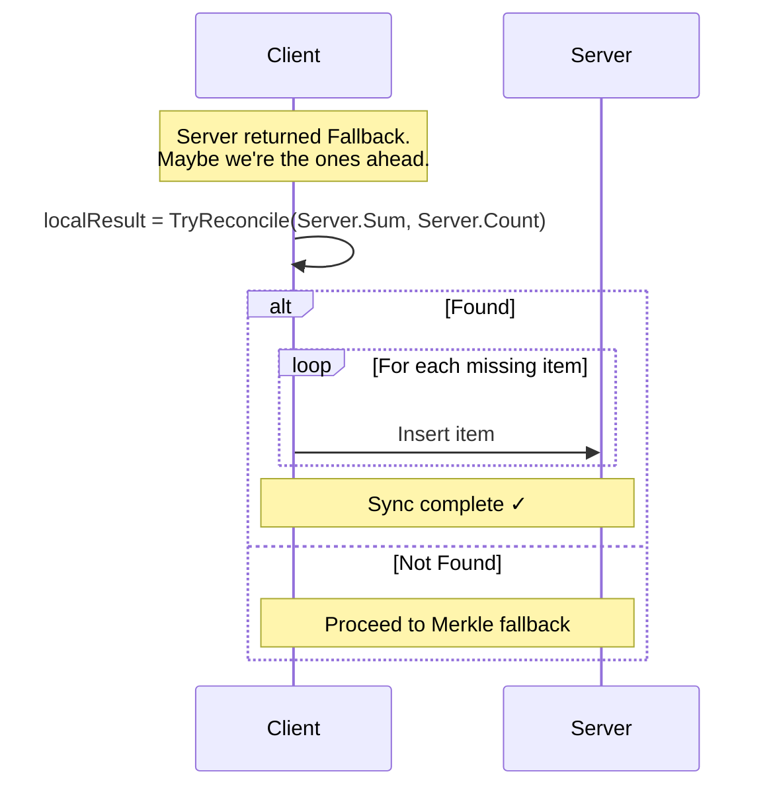
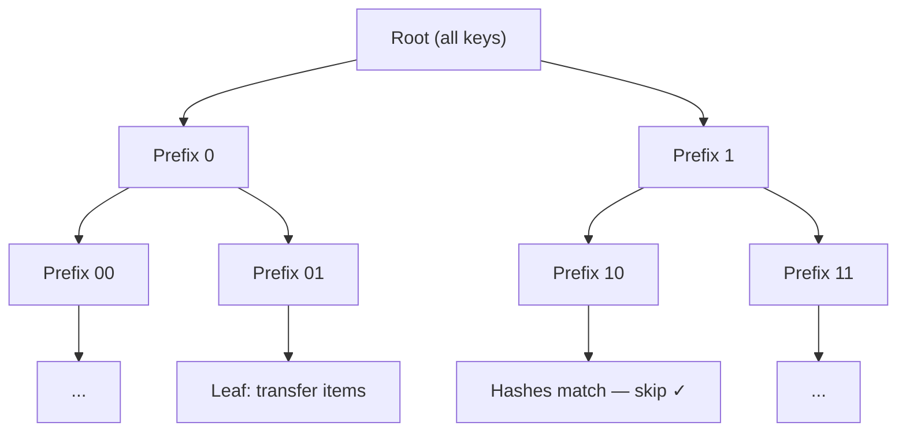
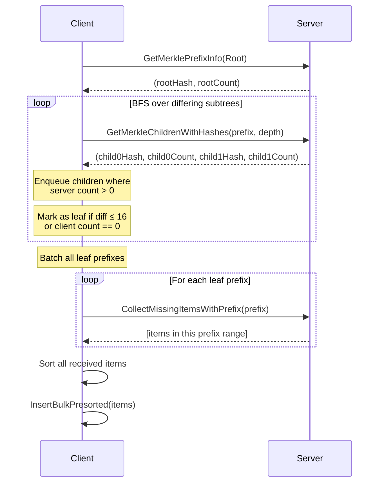
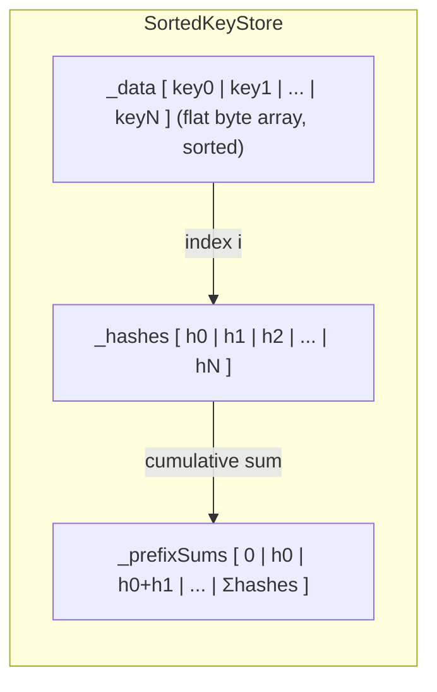
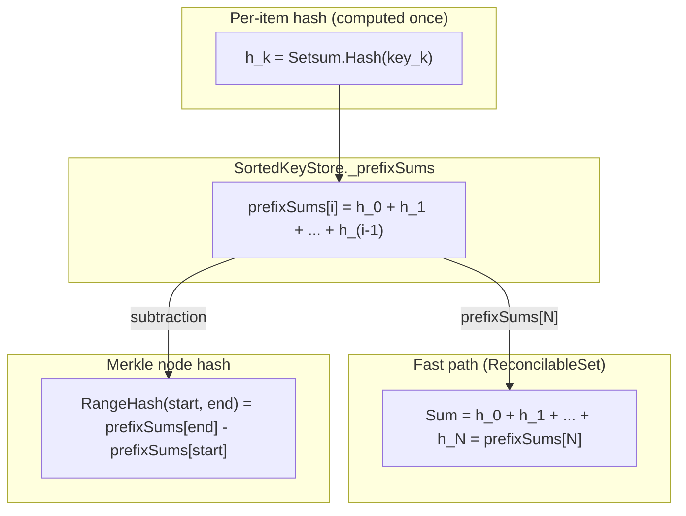

# Setsum Sync

A set-reconciliation library for efficiently synchronising two sets of 32-byte keys across a network. The protocol minimises round-trips by trying fast heuristic paths before falling back to a full Merkle traversal.

---

## Overview

The core challenge: two nodes each hold a set of 32-byte keys. They want to converge to the same set with as few network round-trips as possible, without transferring keys they already share.

The library solves this in three escalating strategies:

1. **Fast Path** — Setsum peeling (1 round-trip, works for tiny diffs)
2. **Push Path** — if the *client* is ahead, push its extras to the server (0–1 round-trips)
3. **Merkle Fallback** — binary-prefix trie traversal for large diffs (O(log N) round-trips)

---

## Core Data Structure: Setsum

A `Setsum` is a commutative, invertible hash over a set of items. Its key properties are:

- **Additive**: `sum(A ∪ B) = sum(A) + sum(B)`
- **Invertible**: `sum(A) - sum(B) = sum(A \ B)` when B ⊆ A
- **Order-independent**: inserting items in any order gives the same sum

This allows the server to compute what a client is missing by subtraction alone, without scanning the entire dataset — as long as the diff is small enough to "peel" apart.

---

## The Three Sync Paths

### Path 1: Fast Path (Setsum Peeling)

The client sends its `(Sum, Count)` tuple to the server. The server subtracts to find the diff sum and count, then tries to identify the missing items by searching its recent insertion history.

**When it works:** The diff is ≤ 10 items and all missing items appear in the server's recent history (circular buffer of 128 entries).

**Peeling algorithm:** Recursive backtracking search over recent history. For diffs of ≤ 3 items it searches the full 128-entry history; for diffs of 4–10 items it limits to the 20 most recent entries.

---

### Path 2: Push Path

If the server returned `Fallback`, it might be because the *client* is ahead (has items the server lacks). The client runs `TryReconcile` in reverse — checking if the server's `(Sum, Count)` can be peeled against the client's history.

---

### Path 3: Merkle Fallback

A binary-prefix trie traversal. Keys are compared bit-by-bit from the most significant bit. Each tree node covers all keys sharing a common bit-prefix. The client and server exchange hash+count information for subtrees, recursing only into subtrees that differ.

The traversal uses a breadth-first search (BFS) queue. For each node the server provides `(Hash, Count)` for both children in a single call. Two optimisations short-circuit expensive subtrees:

- **Count-aware short-circuit**: if the client count is 0 and the server count is N, skip the hash check and go straight to fetching items.
- **Leaf threshold**: if `serverCount - clientCount ≤ 16`, treat the node as a leaf and schedule a direct item transfer rather than recursing further.
- **Batched leaf transfers**: all leaf prefixes are collected during the BFS, then fetched in a single batch — collapsing O(leaves) round-trips into one.

---

## Storage: `SortedKeyStore`

Keys are stored in a flat `byte[]` array sorted by lexicographic key order. A `Setsum[]` array holds the corresponding hash for each key, enabling O(1) range-hash queries via prefix sums.

**Range query**: `RangeInfo(lo, hi)` binary-searches for `start` and `end`, then returns `prefixSums[end] - prefixSums[start]` in O(log N).

**Pending buffer**: New insertions go into an unsorted `_pending` buffer. It is radix-sorted and merged into the main store lazily on the next query — avoiding repeated O(N log N) sorts during bulk inserts.

**Radix sort**: Two-pass LSB radix sort on key bytes 0–1, followed by insertion sort within same-prefix buckets (~15 items each, all in L1 cache). This achieves O(N) sort with sequential memory access.

---

## Relationship Between the Setsum and the Merkle Hashes

This is a subtle but important design point. The Setsums used for fast-path peeling and the Setsums used as Merkle node hashes are **not independent** — they are the same mathematical object computed over different subsets of the data. Understanding the overlap shows both why the design is elegant and how the implementation exploits it to eliminate redundancy.

### They share the same hash function

Every key `k` has exactly one per-item hash: `h_k = Setsum.Hash(k)`. This hash is computed once on insertion and stored in `SortedKeyStore._hashes[i]`. The same `h_k` is used for **both** purposes:

- **Fast-path peeling**: `ReconcilableSet.Sum` is a computed property that reads `_store.TotalInfo().Hash`, giving the global Setsum used in round-trip 1.
- **Merkle node hashes**: `RangeInfo(lo, hi)` returns `_prefixSums[end] - _prefixSums[start]`, which is the sum of `h_k` for all keys in that key-range — exactly a Merkle subtree hash.

A Merkle node hash is simply the global Setsum restricted to one prefix bucket. The root Merkle hash (over all keys) and the fast-path global `Sum` are the **same value** from the **same algebraic structure**.

### What this means for the Merkle tree conceptually

Because Setsum is additive and invertible, the full Merkle trie is implicitly encoded in `_prefixSums` — no tree nodes are materialised. Any subtree hash can be recovered in O(log N) (two binary searches + one subtraction). This is the key insight that makes the design work:

A traditional Merkle tree must store every internal node hash explicitly (O(N) space for a balanced tree, O(N log N) for a naive implementation). This design stores only the leaf hashes and their prefix sums — the same O(N) space — while computing any internal node hash on demand. The trade-off is that verifying a single leaf requires two binary searches rather than a direct pointer walk, but for the sync use-case (where you always query ranges, not individual leaves) this is strictly better.

## Complexity Summary

| Scenario | Round Trips | Notes |
|---|---|---|
| Sets are identical | 1 | Setsum comparison |
| Client missing ≤ 3 items | 1 | Full history peel |
| Client missing 4–10 items | 1 | Recent history peel |
| Client ahead by ≤ 10 items | 1–N | Push path (one trip per item currently) |
| Large diff | O(log N) | Merkle BFS + 1 batch fetch |

> **Leaf threshold** (`LeafThreshold = 16`) and **max depth** (`MaxPrefixDepth = 64`) are the two main tuning parameters controlling the trade-off between round-trips and data over-transfer in the Merkle path.

---

## Key Files

| File | Purpose |
|---|---|
| `ReconcilableSet.cs` | High-level set with fast-path peeling and Merkle delegation |
| `SortedKeyStore.cs` | Flat sorted array store with O(1) range-hash via prefix sums |
| `BitPrefix.cs` | Bit-level trie prefix for Merkle traversal |
| `ReconcileResult.cs` | Discriminated union result type (`Identical / Found / Fallback`) |
| `SyncSimulator.cs` | Test harness simulating two-node sync, counting round-trips |