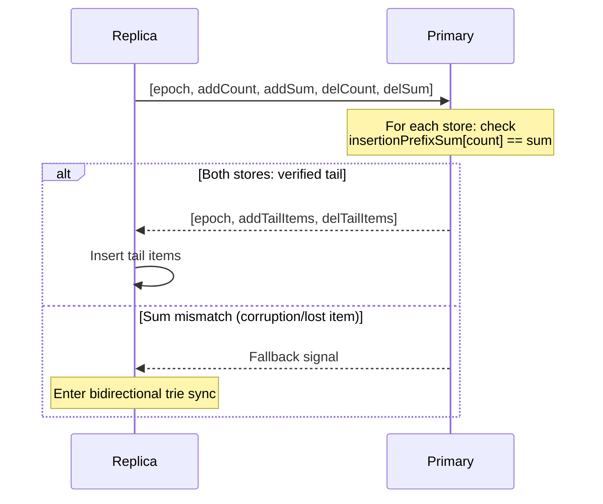
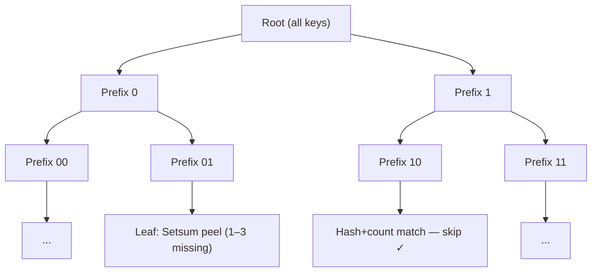
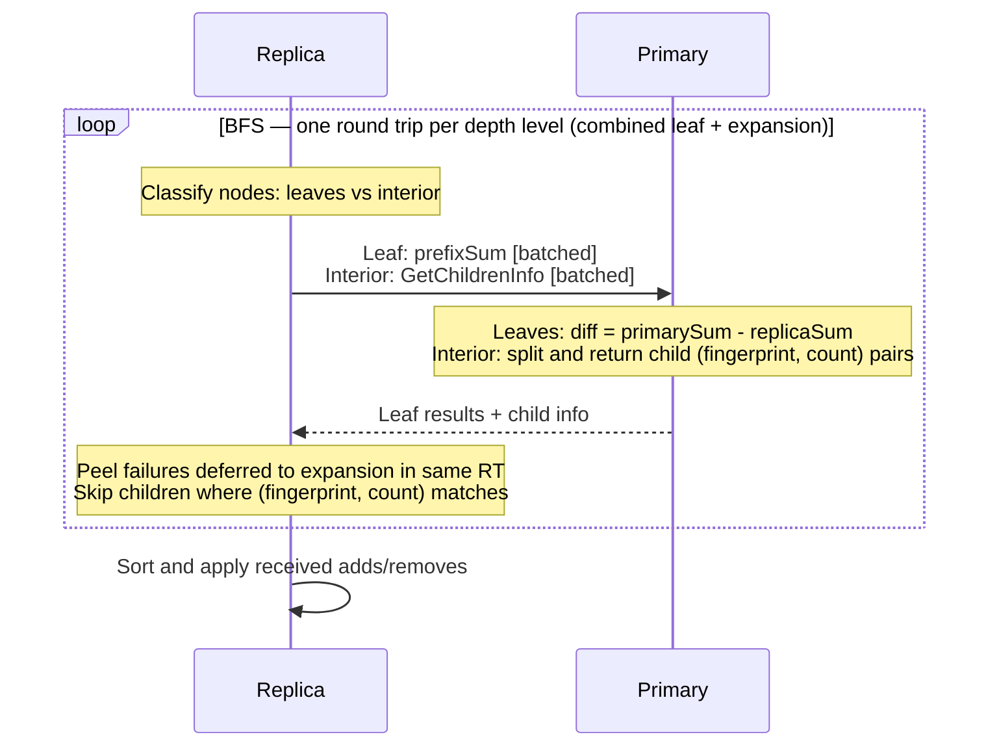
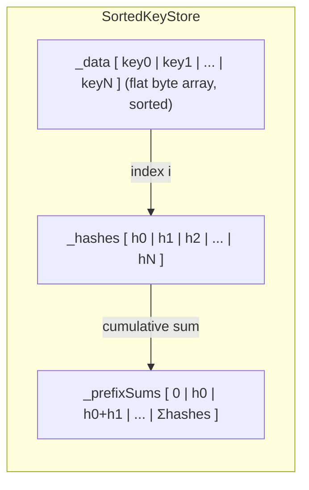
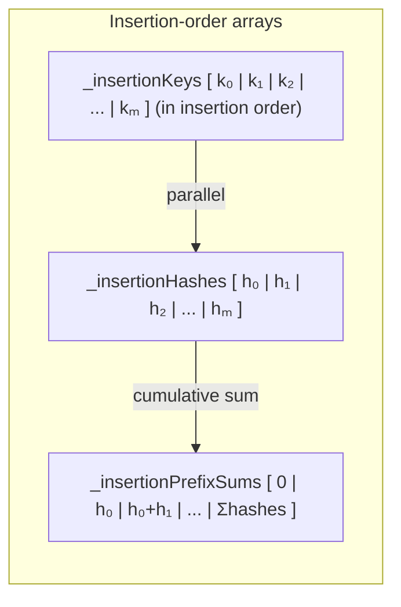
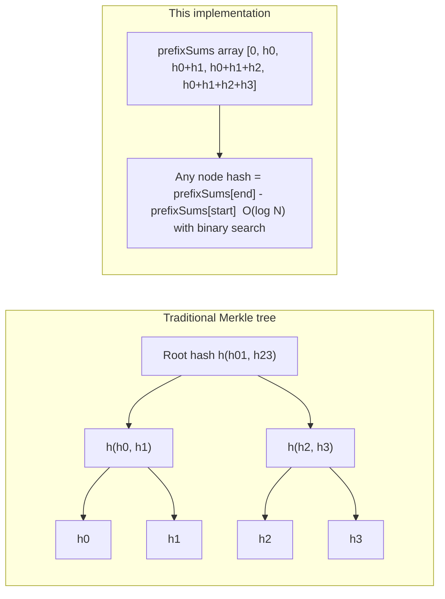
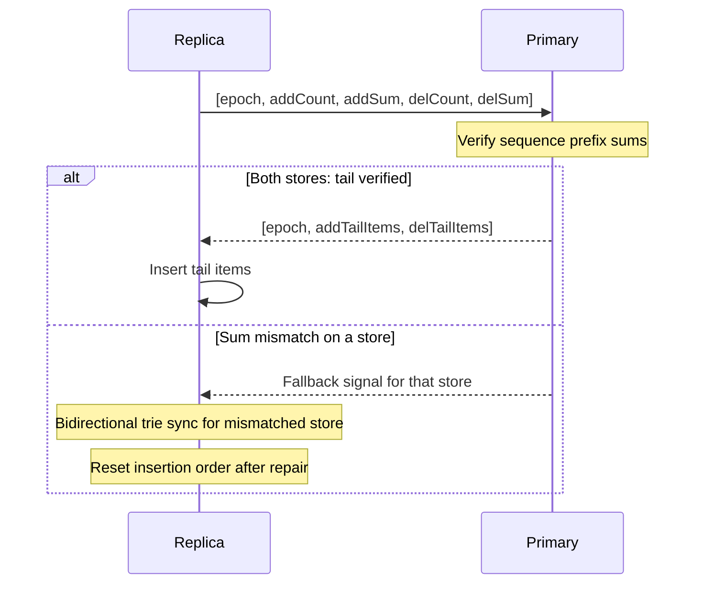
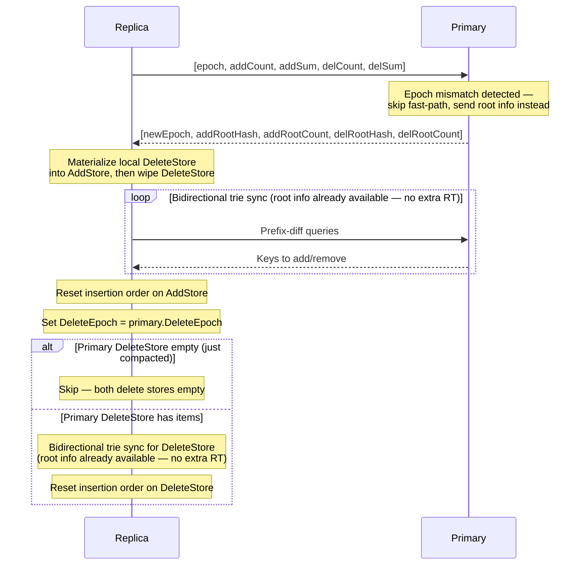

# Setsum Sync

A set-reconciliation library for efficiently synchronising two sets of 32-byte keys across a network. The protocol minimises round-trips by trying a sequence-based fast path before falling back to a full bidirectional binary-prefix trie traversal.

This protocol assumes all participating nodes are mutually trusted. The reported counts and sums are accepted at face value. A malicious node could trigger expensive computations. The upside is that this setup allows for a lot of optimizations.

---

## Overview

The core challenge: two nodes each hold a set of 32-byte keys. They want to converge to the same set with as few network round-trips as possible, without transferring keys they already share.

The library solves this in two escalating strategies:

1. **Fast Path** — Sequence-based tail send (works for any diff size where the replica is a prefix of the primary's insertion history)
2. **Trie Fallback** — Bidirectional binary-prefix trie traversal for arbitrary diffs (1 RT per BFS depth level)

---

## Core Data Structure: Setsum

A `Setsum` is a commutative, invertible hash over a set of items. Its key properties are:

- **Additive**: `sum(A ∪ B) = sum(A) + sum(B)`
- **Invertible**: `sum(A) - sum(B) = sum(A \ B)` when B ⊆ A
- **Order-independent**: inserting items in any order gives the same sum

This allows the primary to compute what a replica is missing by subtraction alone — and at trie leaves, to identify up to 3 missing items without a full key exchange.

---

## The Two Sync Paths

### Path 1: Sequence-Based Fast Path

Every insert is numbered with a monotonically increasing sequence number. Both stores (add and delete) maintain an insertion-order array alongside the sorted key store, with prefix sums over the insertion hashes.

The replica sends `(insertionCount, totalSum)` for each store. The primary verifies that `insertionPrefixSum[replicaCount] == replicaSum` — i.e. the replica holds exactly the first N items from the primary's insertion history. If verified, the primary sends the tail items `[N+1..M]`.



**When it works:** The replica's store is an exact prefix of the primary's insertion history. This covers the common case of a replica that simply fell behind — regardless of how many items it's missing. A diff of 1 item or 100,000 items both resolve in a single round trip.

**When it fails:** If the replica has corrupted data (lost an item, gained a spurious item), the sum check fails and the protocol falls back to trie sync. After trie repair, the replica resets its insertion-order tracking from its current store contents, so future fast paths work again.

---

### Path 2: Bidirectional Trie Sync (Fallback)

A bidirectional binary-prefix trie traversal. Keys are compared bit-by-bit from the most significant bit. Each trie node covers all keys sharing a common bit-prefix. The replica and primary exchange subtree `(hash, count)` pairs, recursing into subtrees where either side differs, until each differing subtree is small enough to resolve via Setsum peeling.

Unlike a unidirectional trie that can only add items, the bidirectional trie handles both directions in a single BFS pass:
- Primary has items the replica doesn't → add to replica
- Replica has items the primary doesn't → remove from replica

This makes it the universal fallback for all mismatch scenarios: sum mismatch (replica corruption), epoch mismatch (compaction), or any other inconsistency.



#### BFS traversal

The BFS processes one full depth level per round trip (level-batched). For each node, the primary splits into `2^BitsPerExpansion` children and returns `(fingerprint, count)` for each. Children are enqueued only if their `(fingerprint, count)` differs between primary and replica — matching subtrees are skipped immediately.

Expansion uses **truncated 64-bit fingerprints** instead of full 32-byte Setsums for mismatch detection. This is sufficient for comparison (~2^-64 false positive rate) and saves 24 bytes per entry — a significant reduction when tens of thousands of subtrees are compared. The full Setsum is only fetched on demand for leaf resolution (e.g. when the replica needs to peel locally).

A node becomes a leaf when:
- `primaryCount == 0` — primary has nothing here; replica's items are stale and removed locally (no RT needed), or
- `replicaCount == 0` — replica has nothing here; primary sends all its items directly, or
- `|primaryCount - replicaCount| <= 3` — a small count diff; resolved via Setsum peeling (see below), or
- `depth >= MaxPrefixDepth` — maximum trie depth reached; full key exchange.

All leaf resolutions and child-count expansions are batched into a **single combined round trip per BFS level**. If a leaf's peeling attempt fails, it is deferred to the expansion pass within the same round trip.



#### Leaf resolution via Setsum peeling

Leaf resolution handles three directional cases:

**Primary ahead** (`signedDiff > 0`): The replica sends its `prefixSum` (32 bytes). The primary computes `diff = primaryPrefixSum - replicaPrefixSum` and peels the missing items from the diff.

**Replica ahead** (`signedDiff < 0`): The replica requests the full primary hash (32 bytes) and peels locally — identifying items it holds that the primary doesn't. If the expansion already provided the full hash (e.g. at the root level), this resolves with zero wire traffic.

**Same count, different hash** (`signedDiff == 0`): Expanded further — both sides have the same count but different content, so descending reveals where the actual differences are.

The peeling itself works on the Setsum diff:

```
diff = primaryPrefixSum - replicaPrefixSum
```

**k=1:** `diff` equals exactly one item's hash. Linear scan over items under the prefix.

**k=2:** `diff` equals the sum of two items' hashes. O(n²) pair scan, guarded by `MaxPrimaryCountForPairPeel` (512 items).

**k=3:** O(n²) scan with a stack-allocated hash-table probe for the third item. Guarded by a count limit of 256. The temporary table is 4 KB on the stack — no heap allocation.

For `replicaCount == 0` the primary simply returns all its items under the prefix directly.

All scans read directly from the stored `_hashes[]` array in `SortedKeyStore` — no re-hashing of keys is performed, and no key copies are allocated until a match is confirmed.

---

## Storage: `SortedKeyStore`

Keys are stored in a flat `byte[]` array sorted by lexicographic key order. A `Setsum[]` array holds the corresponding hash for each key, enabling O(log N) range-hash queries via prefix sums.



**Range query**: `RangeInfo(lo, hi)` binary-searches for `start` and `end`, then returns `prefixSums[end] - prefixSums[start]` in O(log N).

**Peeling scan**: `TryPeelRangeByIndex(start, end, diff, maxCount)` walks `_hashes[start..end]` directly for the linear (k=1), pair (k=2), and triple (k=3) scans. The k=3 scan uses a stack-allocated 4 KB hash table for O(1) third-item lookups — no heap allocation. Keys are only copied off `_data` when a match is confirmed — the miss path allocates nothing.

**Descendant splits**: `GetDescendantSplits(start, end, depth, bits)` recursively bisects a range into `2^bits` sub-ranges at successive bit depths, returning boundary indices. Used by multi-bit expansion to split a parent into all children in one pass.

**Pending buffer**: New insertions go into an unsorted `_pending` buffer. It is radix-sorted and merged into the main store lazily on the next query — avoiding repeated O(N log N) sorts during bulk inserts.

**Radix sort**: Four-pass LSB radix sort on key bytes 0–3, followed by insertion sort within same-prefix buckets (average <1 item for N ≤ 4 billion, so effectively a no-op). This achieves O(N) sort with sequential memory access.

---

## Insertion-Order Tracking

`ReconcilableSet` maintains a parallel set of arrays alongside `SortedKeyStore`:



The prefix sum at index N gives the total hash of the first N inserted items. This enables O(1) verification that a replica holds exactly the primary's first N items: just compare `insertionPrefixSum[N]` with the replica's reported sum.

**`ResetInsertionOrder()`** rebuilds the insertion-order arrays from the current sorted store contents. Called after any operation that invalidates insertion order: compaction (keys removed from sorted store), epoch repair, trie sync fallback, or `DeleteBulkPresorted`. After reset, `InsertionCount == Count()` and future inserts resume appending normally.

---

## Why Setsum Works for Trie Leaves

Every key `k` has exactly one per-item hash `h_k = Setsum.Hash(k)`, computed once on insertion. The trie node hash for any prefix is simply the sum of `h_k` over all keys under that prefix — recoverable in O(log N) from the prefix-sum array.

At a trie leaf where `missingCount == 1`:

```
diff = primaryPrefixSum - replicaPrefixSum = h_missing
```

The missing item's hash is isolated exactly. The primary node scans its prefix items and finds the key whose `Setsum.Hash(key) == diff` — no guessing, no backtracking, one pass.

At a trie leaf where `missingCount == 2`:

```
diff = primaryPrefixSum - replicaPrefixSum = h_missing1 + h_missing2
```

Primary tries all pairs `(i, j)` and checks `_hashes[i] + _hashes[j] == diff`. Both scans reuse the hashes already computed on insertion — `Setsum.Hash` is never called during leaf resolution.

### Implicit trie from a flat array

Because Setsum is additive and invertible, the full binary-prefix trie is implicitly encoded in `_prefixSums` — no tree nodes are materialised. Any subtree hash is recovered in O(log N) via two binary searches to find the range boundaries, and one O(1) subtraction `prefixSums[end] - prefixSums[start]`.



A traditional Merkle tree must store every internal node hash explicitly and rebalance on insert or delete. This design stores only the leaf hashes and their prefix sums — the same O(N) space — with no rebalancing: the trie structure is defined entirely by key ordering, so insertions are sorted merges and all subtree hashes update implicitly.

---

## Wire Optimizations

Several optimizations reduce the bytes transferred during trie sync:

**Truncated fingerprints for expansion.** Expansion responses use 8-byte fingerprints (`Setsum.Fingerprint64()`) instead of full 32-byte Setsums. This saves 24 bytes per child entry. With ~57K entries in a typical large-diff sync, this reduces Rx by ~1.4 MB. The full Setsum is only fetched on demand when a leaf needs it for peeling (32 bytes per leaf).

**Local peeling for replica-ahead leaves.** When the replica has items the primary doesn't (`signedDiff < 0`), the replica can peel locally using the primary's hash — no keys travel over the wire for removals. The only cost is fetching the full primary hash (32 bytes) when the expansion only provided a fingerprint.

**Asymmetric full key exchange.** At maximum trie depth, the replica sends its keys and the primary responds with only the keys to add. The replica computes removals locally by diffing the two sorted lists. This halves the response size compared to sending both adds and removes.

**Combined leaf + expansion round trips.** Leaf resolution and child expansion are batched into a single round trip per BFS level, avoiding separate network calls for each phase.

---

## Complexity Summary

| Scenario | Round Trips | Bytes | Notes |
|---|---|---|---|
| Sets are identical | 1 | ~76 | Combined epoch + sequence check for both stores |
| Replica behind by D items | 1 | ~76 + D×32 | Tail send — works for any D, not just small diffs |
| Replica corrupted (sum mismatch) | 1 + O(log N) | O(D × 32) | 1 RT detects mismatch + bidirectional BFS |
| Epoch mismatch (empty del store) | 1 + O(log N) | O(D × 32) | 1 RT (returns root info) + bidirectional BFS; delete store skipped |
| Epoch mismatch (non-empty del store) | 1 + O(log N) + O(log N) | O(D × 32) | 1 RT + add-store BFS + delete-store BFS (root piggybacked) |

The epoch handshake and both store sequence checks are pipelined into a **single combined round trip**. The replica sends `[epoch, addCount, addSum, delCount, delSum]` and the primary responds with either tail items (fast path) or a fallback signal. If both stores resolve via fast path, the entire sync completes in 1 RT — regardless of diff size.

When fallback is needed, the bidirectional trie sync uses one RT per BFS depth level, bounded by O(log N). Both primary and replica store bounds are carried through the BFS, so child splits reuse parent bounds via O(log range) scans rather than O(log N) binary searches from scratch.

After any trie sync, the replica resets its insertion-order tracking from its current store contents. The replica's count then equals the primary's count, so future tail sends work naturally (option B — no explicit sequence exchange needed).

---

## Delete Protocol

Set reconciliation alone is not enough: a key the primary has removed should eventually disappear from replicas too. Deletes are tracked separately so removals can be synced with the same guarantees as insertions, without complicating the trie protocol.

### Data Model

Each node owns two append-only stores:

- **`AddStore`** — all inserted keys, synced primary→replica. Never mutated by deletes.
- **`DeleteStore`** — tombstones for deleted keys, synced primary→replica.
- **Effective membership** — `AddStore − DeleteStore`, computed at query time.

Both stores are strictly append-only. This keeps the protocol valid across compactions: the primary is always a superset of the replica within each store.

### Why Epochs Exist

`DeleteStore` tombstones would grow forever without compaction. Epochs let the primary compact safely while giving replicas an unambiguous signal that compaction occurred.

Without epochs you must either keep tombstones forever, or risk replicas silently missing deletes that were compacted before they synced.

### Primary Compaction

Compaction works by applying all pending tombstones to `AddStore`, wiping `DeleteStore`, and incrementing `DeleteEpoch`. The `AddStore`'s insertion-order tracking is reset from the post-compaction state so the sequence-based fast path starts fresh.

### Normal Sync Flow (No Epoch Mismatch)



The epoch handshake and both store sequence checks are pipelined into a single round trip. After both stores sync, the effective set (`AddStore − DeleteStore`) is consistent at query time. Tombstones are not physically applied to `AddStore` on the normal path — the subtraction is computed dynamically.

### Epoch-Mismatch Recovery

If `replica.DeleteEpoch != primary.DeleteEpoch`, the replica's `DeleteStore` may reference tombstones the primary has already compacted away. The replica recovers before resuming normal sync:



When the primary detects an epoch mismatch, it **skips fast-path evaluation** and instead responds with the root `(hash, count)` for both stores. This eliminates separate root query round trips. If the primary's delete store is empty after compaction (the common case), the delete store sync is skipped entirely.

The repair uses a **bidirectional** trie traversal that handles both directions in a single BFS pass: keys the replica is missing (primary added new items) and keys the replica holds that the primary has compacted away. After repair, insertion-order tracking is rebuilt on both stores so the sequence-based fast path works again.

### Replica Data Corruption

If a replica's data becomes inconsistent (lost items, spurious items, disk corruption), the sequence-based fast path will detect the sum mismatch and signal fallback. The bidirectional trie sync then resolves all differences — adding missing keys and removing spurious ones — in a single BFS pass. After repair, insertion-order tracking is rebuilt so subsequent syncs resume using the fast path.

This means the protocol self-heals from arbitrary replica corruption without any special handling: the same trie-sync fallback used for epoch mismatches handles corruption recovery.

---

## Key Files

| File | Purpose |
|---|---|
| `Setsum.cs` | Commutative, invertible 256-bit hash with SIMD arithmetic and 64-bit fingerprint extraction |
| `ReconcilableSet.cs` | High-level set with sequence-based fast path, insertion-order tracking, trie delegation, and leaf resolution |
| `SortedKeyStore.cs` | Flat sorted array store with O(log N) range-hash, zero-allocation peeling (k=1/2/3), and descendant splitting |
| `BitPrefix.cs` | Bit-level trie prefix with multi-bit extension for binary-prefix traversal |
| `ReconcileResult.cs` | Discriminated union result type (`Identical / Found / Fallback`) |
| `SyncNodes.cs` | Wire protocol: sequence request/response, epoch mismatch, fingerprint expansion, byte accounting |
| `SyncNodes.Triesync.cs` | Bidirectional trie sync BFS with combined leaf+expansion RTs and truncated fingerprints |
| `SyncableNode.cs` | Per-node add/delete stores, compaction, tombstone materialization, and epoch management |
