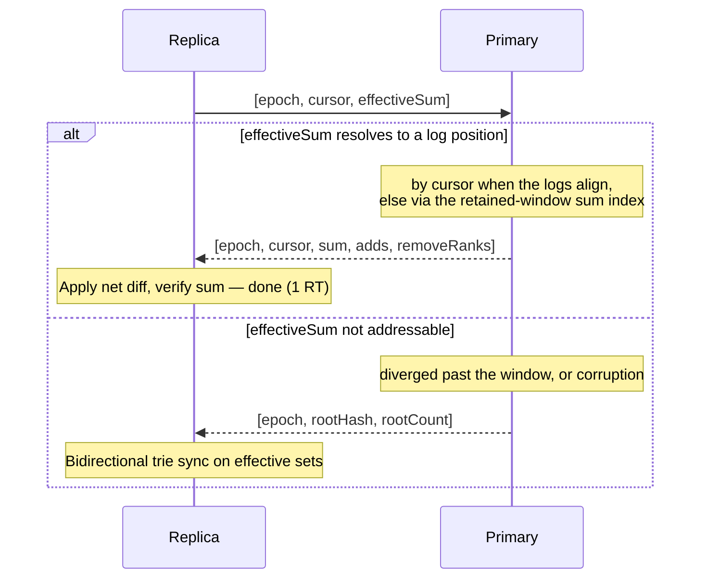
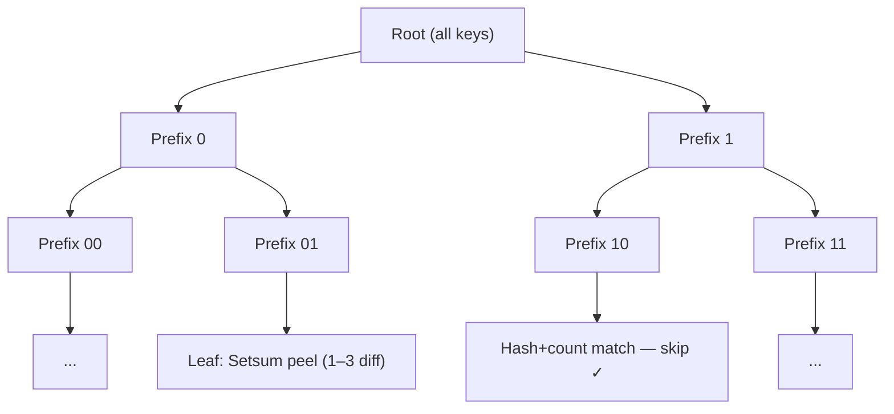

# Setsum Sync

A unidirectional, stateless set-reconciliation protocol for efficiently synchronising two sets of 32-byte keys across a network. Sync always flows **primary → replica**: the primary is the authoritative owner of the set, and replicas converge to it. The primary keeps **no per-replica state** — every sync is self-describing because the replica sends its own position and checksum in a single message.

The protocol minimises round-trips by trying a **sum-addressable** fast path before falling back to a binary-prefix trie traversal. The fast path resolves the replica's state by the *content* of its set — its effective sum — rather than by a log position that a compaction would invalidate, so a replica that is only a little behind fast-paths in a single round trip even across a compaction. The trie traversal itself is bidirectional (it discovers items to add *and* remove from the replica in a single pass), but the sync direction is always primary → replica.

This protocol assumes all participating nodes are mutually trusted — reported counts and sums are accepted at face value.

---

## Data Model

Both the primary and each replica maintain their own independent copy of the same structures:

- **Operation log** — an ordered sequence of inserts (`+key`) and deletes (`-key`), with prefix sums tracking the effective setsum at each position. It grows unbounded between compactions and is trimmed only at compaction, so within an epoch every past position stays addressable
- **Sum index** — a *continuously* windowed map of each effective sum tag → its log position, covering the most recent `SumIndexWindow` operations. Keyed by the same 8-byte tag the replica puts on the wire, so request and index speak one address; this roughly halves the index's per-entry cost, though the retained log window dominates total memory, so the saving is ~25% overall rather than the index's 2×. The oldest entry is evicted on every new operation, so — unlike the log — the index never exceeds the window. This is what makes the fast path sum-addressable: a replica is matched by what its set *contains*, so the match survives a compaction that renumbers positions. It is per-set state (one window per set), not per-replica, so statelessness with respect to who is syncing is preserved
- **Effective set** — the current membership set, maintained as a sorted store of `Key` (a 32-byte value type, so no allocation or comparer object per key) for trie-based queries. It is a true set: an insert of a key already present is dropped at flush time rather than logged, so the log's prefix sum never drifts from the set's sum. The store also carries a running setsum, so reading the root `(hash, count)` is O(1) — the O(N) per-key prefix-sum array is built only when the trie fallback actually needs it
- **Version** — a monotonic membership counter, advanced by every logged operation and never rewound by compaction. Long-polling replicas park against it
- **Epoch** — incremented on compaction; lets a replica tell that the log was re-sequenced so it does not trust a raw position number across the bump
- **Cursor** — a replica's opaque bookmark into the *primary's* log, handed back by the primary on every response. Deliberately not the length of the replica's own log: the two diverge after a trie sync or a compaction-crossing fast path, and conflating them is what used to silently disable the cheap position address

The setsum's invertibility means prefix sums work naturally over mixed operations:

```
Log:       [+A, +B, -A, +C]
PrefixSum: [H(A), H(A)+H(B), H(B), H(B)+H(C)]
```

The prefix sum at any position is the setsum of the effective set at that point.

The primary's log is authoritative. A replica's log tracks its own view — during sync, the replica sends `(epoch, cursor, effectiveSum)` and the primary responds purely from its own log, sum index, and effective set, with no memory of any previous sync. This means any number of replicas can sync independently, and a replica that goes offline for an arbitrary period simply resumes from wherever it left off.

**Compaction** trims the log to a recent window of the most recent `SumIndexWindow` operations (default 65,536) and increments the epoch. Crucially it keeps the *real* recent op history — actual adds and deletes, not a flat list of all-inserts — and rebuilds the sum index over the retained window. A replica whose effective sum still lands in that window therefore fast-paths *across* the compaction in one round trip; only a replica that has diverged further than the window falls back to a trie sync over effective membership. The window bounds per-set memory and is the single lever trading memory for how far behind a replica can be and still bridge a compaction.

#### Sizing the window

Retained cost is ~100 B per operation in the window: ~35 B for the sum index (a `Dictionary<ulong,int>`) and ~65 B for the retained log itself (key, direction flag, and prefix sum across three lists). Measured on a node holding a 2 M-key set, over the 64 MiB floor that the effective set costs regardless:

| `SumIndexWindow` | window cost | fast-paths a replica up to |
|---|---|---|
| 1,024 (2¹⁰) | +0.4 MiB | 1 K ops behind |
| **65,536 (2¹⁶)** | **+6 MiB** | **64 K ops behind** |
| 1,048,576 (2²⁰) | +102 MiB | 1 M ops behind |

2¹⁶ is the default because it is where the curve turns: it costs 6 MiB and fast-paths every benchmark scenario except a ~100 K-op divergence, while reaching for those last cases at 2²⁰ costs a further ~96 MiB — a bad trade unless replicas routinely fall that far behind. Below ~2¹⁰ the window stops bridging realistic compactions at all.

This cost is **per set, not per replica**. The primary stores nothing keyed by peer identity: the sum index is keyed by set content, long-poll waiters share a single signal, and the cursor lives on the replica. One node syncing with a thousand replicas retains exactly what one syncing with one retains. The per-peer cost is a held connection while a long poll is parked, plus the transient per-request tail, which is proportional to the diff being served rather than to the number of peers.

---

## Core Data Structure: Setsum

A `Setsum` is a commutative, invertible hash over a set of items:

- **Additive**: `sum(A ∪ B) = sum(A) + sum(B)`
- **Invertible**: `sum(A) - sum(B) = sum(A \ B)` when B ⊆ A
- **Order-independent**: inserting items in any order gives the same sum

This lets the primary node compute what a replica is missing by subtraction alone — and at trie leaves, identify up to 3 missing items without a full key exchange.

---

## Sync Protocol

Every sync is initiated by the replica. It sends its epoch, log position, and effective-set sum in a single message — this fully describes the replica's state without the primary needing to remember anything about it. The primary tries to resolve that effective sum to one of its own log positions; if it can, the diff is the tail from there. Otherwise it falls back to the trie.


```mermaid
sequenceDiagram
    participant R as Replica
    participant P as Primary

    R->>P: [epoch, cursor, effectiveSum]

    alt effectiveSum resolves to a log position
        Note over P: by cursor when the logs align,<br/>else via the retained-window sum index
        P-->>R: [epoch, cursor, sum, adds, removeRanks]
        Note over R: Apply net diff, verify sum — done (1 RT)
    else effectiveSum not addressable
        Note over P: diverged past the window, or corruption
        P-->>R: [epoch, rootHash, rootCount]
        Note over R: Bidirectional trie sync on effective sets
    end
```

### Fast path

First the trivial case: if the replica's sum already equals the primary's current sum, the tail is empty and the sync is a one-message acknowledgement.

Otherwise the primary resolves the sum to a log position two ways, tried in order:

1. **By position** — a cheap first guess. The replica's reported cursor indexes straight into the primary's log, and the primary checks `prefixSum[cursor] == replicaEffectiveSum`. This succeeds whenever the two logs are aligned — same epoch, same op history, nothing re-sequenced between them — which is the common incremental case. It is **unbounded within an epoch**: the log is trimmed only at compaction, so even a replica 100,000 ops behind in the same epoch still has a valid position to resolve against. (Because the cursor is assigned by the primary rather than derived from the replica's own log length, it stays valid across a trie sync and across a compaction the replica was carried over — cases where the two logs no longer align op-for-op. The epoch check still guards the one case that does re-sequence positions underneath a replica: a compaction it was *not* carried across.)
2. **By sum** — the content address. The primary looks the sum up in its retained-window index, which resolves even across a compaction (epoch bump) as long as the replica is within `SumIndexWindow` operations of the primary. Unlike the position path this is **capped at the window**, because the index — unlike the log — is evicted continuously.

Either way the primary then **collapses** the tail from that position into a net diff before sending: a pair of disjoint sorted sets, adds and removes. Because the log is faithful — an add is never logged for a key already present, a delete never for one already absent — a key's state just before its first op in the tail is the opposite of that op, so first and last op together determine its net effect outright:

```
+ … +   absent  → present   ADD
+ … −   absent  → absent    nothing (never sent)
− … −   present → absent    REMOVE
− … +   present → present   nothing
```

Collapsing means ordering no longer matters on the wire, so a key added and later deleted within one tail costs zero bytes instead of two keys. A diff of 1 item or 100,000 items in the same epoch costs the same one round trip, and deletes flow through the exact same fast path as adds.

Every response also carries the primary's post-tail cursor and effective sum. The cursor keeps the cheap position address usable after a trie sync or a compaction-crossing fast path; the sum lets the replica **verify** convergence rather than assume it, falling through to the trie in the same sync if the check fails.

### Trie sync — the universal fallback

The trie sync is not specific to any one failure mode. It is the single repair mechanism for all forms of divergence the fast path cannot address:

- **Sum mismatch** — the replica has lost or gained items (corruption); its sum matches no position in the primary's log, so the bidirectional trie finds and corrects all differences
- **Diverged past the window** — the primary has compacted *and* the replica is more than `SumIndexWindow` operations behind, so its sum has been evicted from the index; one trie sync over effective sets converges both sides

A replica that compacted past but is still *within* the window never reaches here — it fast-paths across the compaction. After any trie sync the primary hands back a fresh cursor, so the next sync resolves via the unbounded position address rather than depending on the windowed sum index. The replica also rebuilds its own operation log from its effective set, which matters only if it is later promoted to primary.

When the fast path fails, the primary piggybacks root `(hash, count)` for the effective set in the same response, so the trie BFS can start immediately with no extra round trip.

---

## Trie Sync (Fallback)

Keys are sorted by their bit representation; each trie node covers all keys sharing a common bit-prefix. The protocol exchanges subtree `(hash, count)` pairs level by level, recursing into subtrees where the two sides differ, until each is small enough to resolve directly.

The traversal is bidirectional in the sense that it discovers differences in both directions — items the replica is missing (added from primary) and items the replica has that the primary doesn't (removed from replica) — but the goal is always to converge the replica to the primary's state:


```mermaid
flowchart TD
    A["Root (all keys)"] --> B["Prefix 0"]
    A --> C["Prefix 1"]
    B --> D["Prefix 00"]
    B --> E["Prefix 01"]
    C --> F["Prefix 10"]
    C --> G["Prefix 11"]
    D --> H["..."]
    E --> I["Leaf: Setsum peel (1–3 diff)"]
    F --> J["Hash+count match — skip ✓"]
    G --> K["..."]
```

One round trip per depth level, batching all leaf resolutions and child expansions. A node becomes a leaf when:

- `primaryCount == 0` — replica's items are stale; removed locally with no wire traffic
- `replicaCount == 0` — primary sends all its items directly
- `|primaryCount − replicaCount| ≤ 3` — *attempted* via Setsum peeling; re-expands deeper if the peel can't isolate the differing items (and a count-equal leaf with mixed adds/removes never peels — it expands)
- `depth ≥ MaxPrefixDepth` — full key exchange (both adds **and** removes)

`MaxPrefixDepth` is 64: the trie discriminates on the first 64 bits of each key, which assumes keys are uniformly distributed there (digests/hashes). Divergent leaves then isolate far above that bound. Any keys that share a full 64-bit prefix collapse into a single depth-64 leaf, reconciled by a direct full key exchange — correct, but without the trie's bandwidth savings, so structured keys with long shared prefixes are out of scope.

### Leaf resolution via Setsum peeling

**Primary ahead** (`signedDiff > 0`): Replica sends its prefix hash; primary subtracts to isolate the diff and identifies the 1–3 missing items by scanning its local hashes.

**Replica ahead** (`signedDiff < 0`): The primary's hash is already in scope from the expansion response. The replica peels locally — **zero wire cost**.

**Same count, different hash** (`signedDiff == 0`): Expanded further.

---

## Wire Protocol

All messages are binary with VarInt-encoded counts. Key = 32 B, Setsum = 32 B.

### Sequence request (replica → primary)

| Field | Size |
|---|---|
| epoch | varint |
| cursor | varint |
| sumTag | 8 B |

~12 B, and it covers everything in one round trip. `cursor` is an opaque bookmark into the primary's log, handed to the replica by a previous response — **not** the length of the replica's own log.

`sumTag` is the low 64 bits of the effective sum. The request only has to pick one of ~`SumIndexWindow` candidate positions, so a full 32-byte digest is far more than it needs. This is an **optimistic address**: a tag collision resolves to the wrong base, and it is the response's full `primarySum` that makes the answer trustworthy — the cost of a collision is a wasted round trip and a trie repair, never a wrong result. The odds scale with the window — ~`SumIndexWindow`/2⁶⁴ — so at the 65,536-entry default that is ~2⁻⁴⁸ per sync, and ~2⁻⁵⁴ at a 1,024-entry window.

### Sequence response (primary → replica)

**Fast path success** — a net diff, not an op stream:

| Field | Size |
|---|---|
| epoch | varint |
| cursor | varint |
| primarySum | 32 B |
| addCount | varint |
| adds | addCount × 32 B |
| removeCount | varint |
| removeRanks | Golomb-Rice coded rank deltas (~1 B each at N = 1 M, D = 10 k) |

There is no per-op flag bitfield: adds and removes are disjoint sets, so the two sides are simply length-prefixed separately, and each is encoded the way that suits it.

In the trie fallback the fan-out per level is chosen from the width of the expansion front rather than fixed: a level costs about `frontSize × 2^bits × (Setsum + varint)` bytes and buys `bits` levels of depth, so a narrow front (a small, localised diff) fans out wide and finishes in two or three round trips, while a wide front stays narrow. A fixed constant gets one of those cases wrong by construction. Set `BitsPerExpansion` explicitly only to measure a particular value.

When the primary's peel at a leaf fails, it returns that node's child `(hash, count)` set in the same response instead of making the replica come back to ask — one fewer real round trip, and no prefix bytes charged for a request never sent.

**Fallback (sum not addressable — corruption, or diverged past the window):**

| Field | Size |
|---|---|
| epoch | varint |
| cursor | varint |
| rootHash | 32 B |
| rootCount | varint |

Followed by trie sync rounds.

### Trie expansion (per BFS level)

**Request** (replica → primary): prefix bytes per child — `ceil(depth / 8)` bytes each.

**Response** (primary → replica): `varint(count) + 32 B hash` per child (hash omitted when count = 0).

### Leaf resolution (within the same BFS round trip)

| Case | Tx | Rx |
|---|---|---|
| replicaCount == 0 | prefix bytes | count × 32 B keys |
| signedDiff > 0 (primary ahead) | prefix + 32 B replicaHash | count × 32 B missing keys |
| signedDiff < 0 (replica ahead) | — | — (replica peels locally) |
| signedDiff == 0 | — | — (expanded further) |
| depth ≥ MaxPrefixDepth | prefix + count × 32 B replicaKeys | (adds + removes) × 32 B keys |

At a `depth ≥ MaxPrefixDepth` leaf the primary returns **both** the keys to add and the keys to remove: the replica sent only its own keys, so it cannot derive `replica \ primary` from the adds (`primary \ replica`) alone.

---

## Complexity

| Scenario | Round Trips | Notes |
|---|---|---|
| Sets identical | 1 | Sequence check, single message |
| Replica behind, same epoch | 1 | Net diff by cursor, any distance |
| Replica behind ≤ `SumIndexWindow` ops, across a compaction | 1 | Sum-addressed net diff |
| Sum mismatch (corruption) | 1 + O(log N) | 1 RT detects mismatch, trie sync repairs |
| Diverged past the window, across a compaction | 1 + O(log N) | Root info piggybacked, single trie pass |

### Steady state and long polling

Most syncs find nothing. Polling spends one exchange per replica per interval forever, and still leaves a replica up to half an interval stale — in a large deployment that null traffic is the single largest line item, and it is pure overhead.

`SyncWhenChangedAsync` parks the request on the set's version counter instead: the primary holds it open rather than spending an exchange to say "no change", and answers the moment membership moves. Null traffic drops to one keepalive per hold window (typically 30–60 s, versus a 1–5 s poll), and staleness drops from poll-interval/2 to a single RTT.

Waiters share one signal and the primary records nothing about who is parked, so statelessness with respect to who is syncing survives. What it costs is a held connection per parked replica — a resource, but not state.

### Latency

Round trips dominate cost on a WAN for small diffs, and that is what the fast path optimises — but a 10,000-item tail is ~320 KB and bandwidth-bound, not RTT-bound. `EstimatedLatencyMs` therefore counts `RoundTrips × RTT + bytes / linkRate` (50 ms RTT and 100 Mbps by default); counting round trips alone reported the same 50 ms for a 3-item and a 10,000-item sync, hiding every byte-level result in the benchmarks meant to measure them. The fast path is always one round trip regardless of diff size, and it now holds across a compaction too whenever the replica is within `SumIndexWindow` operations: a tiny epoch resync that previously took a trie descent (~3 round trips / ~150 ms, more if the differing keys are scattered) collapses to a single round trip (~50 ms). A replica that has diverged further than the window still pays the trie fallback — one round trip per `BitsPerExpansion` bits of prefix depth it descends. At the default of 2, over a 1 M-key set a ~100 K-op divergence measures 20 round trips (~1,370 ms estimated, ~375 ms of local compute), against a single round trip and ~12 bytes of request if the same divergence fits the window. `BitsPerExpansion` is the main lever there: 1 minimises bandwidth but doubles the round trips, while 4 roughly halves them again at the cost of more bytes on sparse diffs.

The fast path optimises round trips, and it is close to byte-optimal in both directions.

**Adds** are data the replica genuinely lacks, so 32 B each is near the floor — sending a *set* of k random 256-bit keys costs at least `k·(256 − log₂k + 1.44)` bits, which is 30.5 B/key at k = 10,000. The remaining ~5% would need gap-coded sorted keys and is not worth a codec. Adds also beat the trie's per-subtree overhead (≈321 KB vs ≈664 KB for 10k adds).

**Deletes** are encoded by *rank*, not by key. The replica already holds the key, and both sides keep the same sorted store, so the primary need only name its index in the replica's set. Sorted ranks are gap-coded and each gap varint-encoded — about **1.3 bytes per delete against the 32 a raw key would cost**.

The primary computes those ranks without materialising the replica's set, so nothing per-replica is stored. The replica's set is the primary's with the net diff undone, `(primary \ adds) ∪ removes`, so:

```
rank_replica(x) = rank_primary(x) − |{a ∈ adds : a < x}| + |{r ∈ removes : r < x}|
```

`rank_primary` is a binary search in the effective set; the corrections are binary searches in the (small, sorted) diff arrays, and since `removes` is sorted the last term is just the loop index. O(log N) per deleted key.

This removes the old delete asymmetry: a delete-heavy tail no longer costs more bytes than the trie, so there is no longer any reason to shrink `SumIndexWindow` on a bandwidth-constrained link. A mis-addressed rank is caught by the response's `primarySum` check rather than silently corrupting the replica.

#### Why varint gaps and not an optimal code

The first implementation used Golomb-Rice, which sits on the information floor. Measured bytes per delete at N = 1 M:

| mean gap | floor | Golomb-Rice | **varint gaps** | fixed 3-byte | bitmap |
|---|---|---|---|---|---|
| 1000 (D = 1 k) | 1.43 | 1.44 | **1.87** | 3.00 | 125 |
| 100 (D = 10 k) | 1.01 | 1.01 | **1.28** | 3.00 | 12.5 |
| 10 (D = 100 k) | 0.59 | 0.59 | **1.00** | 3.00 | 1.25 |
| 2 (D = 500 k) | 0.25 | 0.29 | **1.00** | 3.00 | 0.25 |

Raw keys are 32.00 throughout, so every scheme here is a large win and the spread between them is small by comparison. Rice costs a bit-level writer and reader, a parameter derivation, and — the reason it was dropped — a hidden invariant: both sides had to independently compute the same replica set size to agree on the Rice parameter `b`. If those ever disagreed the decode would produce plausible-looking garbage rather than fail. Varint gaps are self-delimiting and need nothing shared but the count, which removes that class of coupling entirely, reuses a codec the wire format already depends on, and costs ~25% more bytes on a term already 25× smaller than what it replaced.

The one regime where this loses meaningfully is very dense deletes: varint is byte-aligned so it cannot go below 1 B per delete, while Rice reaches 0.29 at mean gap 2. If bulk deletion becomes a real workload, the fix is not to bring Rice back — a plain N-bit bitmap beats it there (0.25) and is about five lines. A one-byte header selecting gaps-vs-bitmap would cover the whole range within ~1.3× of optimal, and would put the choice explicitly on the wire instead of deriving it from state both sides must agree about.

---

## Key Files

| File | Purpose |
|---|---|
| `Setsum.cs` | Commutative, invertible 256-bit hash with SIMD arithmetic |
| `SortedKeyStore.cs` | Sorted flat array with O(log N) range-hash queries, trie prefix queries, and Setsum peeling at leaves |
| `SyncableNode.cs` | Per-node operation log, sum-addressable index, effective set, windowed compaction, and epoch management |
| `SyncNodes.cs` | Sync orchestration and wire-byte accounting |
| `SyncNodes.Triesync.cs` | Bidirectional trie BFS with combined leaf+expansion round trips |
| `Key.cs` | 32-byte key by value — replaces `byte[]` and its comparer |
| `ISyncTransport.cs` | Where messages go and what they cost |
| `BitPrefix.cs` | Bit-level trie prefix with multi-bit extension |
| `Tail.cs` | The collapsed net-diff response: adds, rank-coded removes, cursor, sum |
| `RankCodec.cs` | Varint gap codec for rank-addressed deletes |
| `ChangeSignal.cs` | Version-gated wakeup backing long-polled requests |

## Key precondition

Keys must be uniformly distributed digests. The protocol relies on this twice over: the trie
degenerates to a full-depth key exchange on structured keys, and `Setsum` is *linear* in the
key bytes, so structured keys make a set's sum trivially malleable — an attacker who can choose
keys can solve for a colliding set.

`new Key(digest)` wraps 32 bytes that already satisfy this. Anything else — a path, an id, a
prefix-plus-counter — must go through `Key.FromContent`, which hashes it first. This is the one
place the assumption is stated, and the one place to satisfy it.
